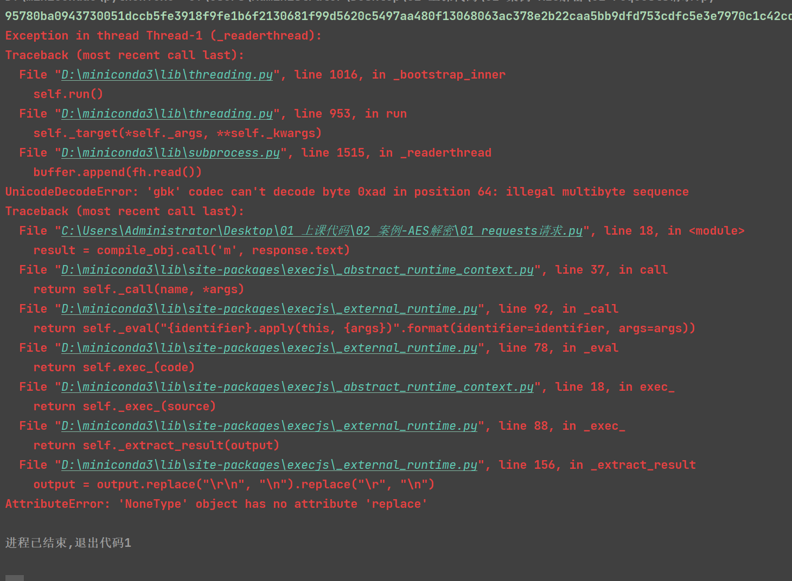
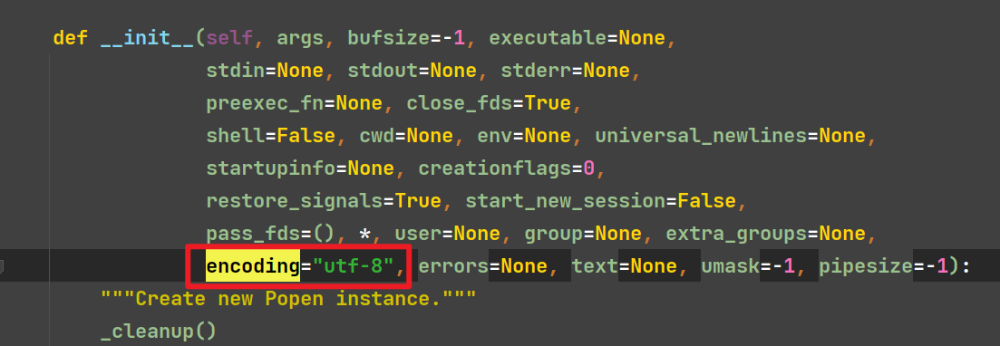

# pyexecjs js代码调用库

要先安装node环境并且添加到环境变量中，不仅方便js的调试还方便程序调用

# pyexecjs和pyexecjs区别

更推荐使用pyexecjs2

| 特性         | pyexecjs (原版)                 | pyexecjs2 (分支)        |
|------------|-------------------------------|-----------------------|
| 维护状态       | 已停止更新（原版最后更新于2015年）           | 活跃维护（社区维护的分支）         |
| Python 兼容性 | 仅支持较旧 Python 版本（如 Python 2.7） | 支持 Python 3.x+        |
| 功能改进       | 基础功能                          | 修复了原版的 Bug，优化了性能      |
| 安装方式       | pip install PyExecJS          | pip install pyexecjs2 |
| API 兼容性    | 旧 API                         | 完全兼容原版 API，可直接替换      |

# 安装/导入

```shell
pip install pyexecjs2
```

```python
# 导入的名称和安装的不一样
import execjs
```

# 使用方法

```python
import execjs

with open('js_code.js', mode='r', encoding='utf-8') as f:
    js_code = f.read()

js_obj = execjs.compile(js_code)  # 编译js，括号内部传js的语法

result = js_obj.call('fun', '参数1', '参数二')  # 调用js方法，js_obj表示编译好的js对象，call方法内部传js中需要调用的函数，和调用函数所需参数(不定长参数)。
# result = js_obj.eval('a')  # 调用返回里面的变量值
print(result)  # 输出执行的结果
```

# 编码报错问题

默认情况下在使用pyexecjs指定编译的时候, 会引用subprocess.py, 此文件默认使用的编码是系统编码, 从而引发报错



## 解决方法一



## 解决方法二

下载使用`pyexecjs2`即可

```shell
pip install pyexecjs2
```
