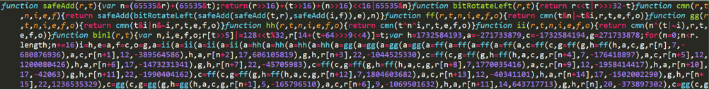
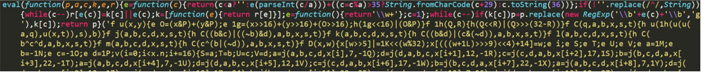
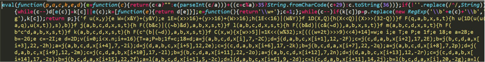
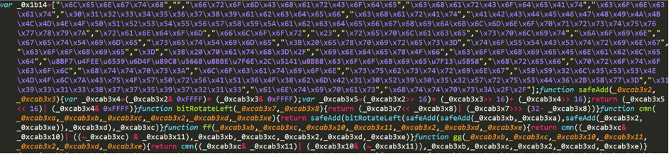
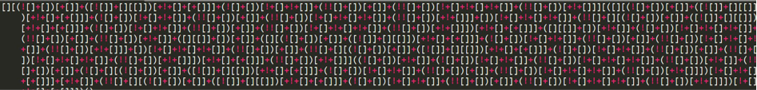
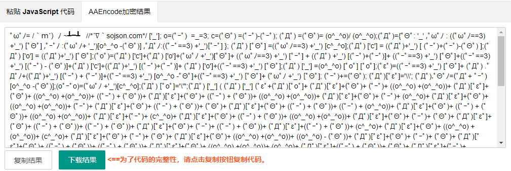

### 1、js混淆的利与弊

**站在网站开发者的角度**

1、是为了保护我们的前端代码逻辑
2、精简代码、加快传输

**站在爬虫者的角度** 

1、增加了获取数据的难度

### 2、常见混淆与反混淆方法

在JavaScript中，基本所有混淆的目的都是防止我们直接获取到JavaScript代码的执行逻辑，让我们看到一些代码逻辑的时候有种无从下手的感觉。对于此我们可以借助**浏览器控制台工具**或者一些**在线解混淆的工具**帮助我们还原代码，从而进行逆向解密。

#### 2、1 JS压缩

特征：将大篇幅的JS代码尽可能的压缩，会把代码中的换行或者空格压缩。

优点：使代码精简，加快前端执行JS效率。



原理：削减是一个从源代码中删除不必要的字符的技术使它看起来简单而整洁。这种技术也 被称为代码压缩和最小化。

解决方式：在**Sources**中可以针对js代码格式化。

#### 2、2 eval混淆加密

js中的 eval() 方法就是一个 js 语言的执行器，它能把其中的参数按照 JavaScript 语法进行解析并执行，简单来说就是把原本的 js 代码变成了 eval 的参数，变成参数后代码就成了字符串，其中的一些字符就会被按照特定格式“编码”

**特征：**

最明显的特征是生成的代码以 eval(function(p,a,c,k,e,r)) 开头



```javascript
eval(function(){console.log(100);return 200})()
```

**原理：**

这类混淆的关键思想在于将需要执行的代码进行一次编码，在执行的时候还原出浏览器可执行的合法的脚本

**破解方法-浏览器**
打开 谷歌 或者 火狐 浏览器
按 F12 打开控制台
把代码复制进去
删除开头 eval 这4个字母
按回车键

**破解方法-node.js**

可以通过工具转化eval混淆的代码

在线转化工具地址: https://wangye.org/tools/scripts/eval/

#### 2、3 变量名混淆

变量名混淆是指将变量名替换为无意义的字符串，增加代码的难度和防止代码的逆向分析。



**字符串字面量混淆：** 首先提取全部的字符串，在全局作用域创建一个字符串数组，同时转义字符增大 阅读难度，然后将字符串出现的地方替换成为数组元素的引用

```JavaScript
var _0x3012 = ['substring', 'atob', 'charCodeAt', 'push', 'test'];
// 打乱数组的内容
(function(_0x3ed35c, _0x48b8fe) {
    var _0x1ad9d9 = function(_0x8eeda7) {
        while (--_0x8eeda7) {
            _0x3ed35c['push'](_0x3ed35c['shift']());
        }
    };
    _0x1ad9d9(++_0x48b8fe);
}(_0x3012, 0x153));
// 用函数实现字符串的调用
var _0x3a8e = function(_0xc40c11, _0x32bbb2) {
    _0xc40c11 = _0xc40c11 - 0x0;
    var _0x4e269a = _0x3012[_0xc40c11];
    return _0x4e269a;
};

console.log(_0x3a8e('0x4'));
```

**变量名混淆：**不同于压缩器的缩短命名，此处使用了下划线加数字的格式，变量之间区分度很低，相比单个字母更难以阅读

```JavaScript
/*变量名混淆*/
var _0x3a8e = function(_0xc40c11, _0x32bbb2) {
    _0xc40c11 = _0xc40c11 - 0x0;
    var _0x4e269a = _0x3012[_0xc40c11];
    return _0x4e269a;
};
```

**方法混淆**：将方法名字用高进制表示

```JavaScript
/*方法名混淆*/
console.log(('')['\x63\x6f\x6e\x73\x74\x72\x75\x63\x74\x6f\x72']['\x66\x72\x6f\x6d\x43\x68\x61\x72\x43\x6f\x64\x65'](65));

console.log(('')['constructor']['fromCharCode'](65));

console.log(''.constructor.fromCharCode(65))
console.log(String.fromCharCode(65));
```

破解方法-IDE、解密工具、浏览器：特殊字符变成普通内容

**特征：**



1. 把变量名、函数名、参数名等，替换成没有语义，看着又很像的名字。

   ```
   _0x21dd83、_0x21dd84、_0x21dd85
   ```

2. 用十六进制文本去表示一个字符串

   ```
   \x56\x49\x12\x23
   ```

3. 利用JS能识别的编码来做混淆。JS是Unicode编码，本身就能识别这种编码。类似的一些变量名，函数名都可以用这个表示，并且调用。

  类似:

  `\u6210\u529f` 表示中文字符(成功)。

  类似:

`\u0053\u0074\u0072\u0069\u006e\u0067.\u0066\u0072\u006f\u006d\u0043\u0068\u0061\u0072\u0043\u006f\u0064\u0065`  代表 String.fromCharCode

  类似：

  `('')['\x63\x6f\x6e\x73\x74\x72\x75\x63\x74\x6f\x72']['\x66\x72\x6f\x6d\x43\x68\x61\x72\x43\x6f\x64\x65'];` 效果等同于String.fromCharCode

4. 把一大堆方法名、字符串等存到数组中，这个数组可以是上千个成员。然后调用的时候，取数组成员去用

   ```javascript
   var arr = ["Date","getTime"];
   var time = new window[arr[0]]()[arr[1]]();
   console.log(time);
   ```

> 解决方案：替换成我们能够看得懂的代码

#### 2、4 控制流平坦化

该技术通过重新组织代码中的控制流语句（如if、for、while语句等）来增加代码的复杂性。具体而言，它会将这些语句拆分成多个小的、相互嵌套的语句，使得代码中的控制流路径更加复杂、难以理解。

以下两段代码的执行结果是相同的:

```javascript
// 正常形态
function foo(x, y) {
  var a = x + y;
  if (a > 10) {
    while (a < 100) {
      a += x;
      if (a < 50) {
        a -= y;
      } else {
        a += y;
      }
    }
  } else {
    for (var i = 0; i < a; i++) {
      if (i % 2 == 0) {
        a += x;
      } else {
        a -= y;
      }
    }
  }
  return a;
}

foo(3, 4);

// 控制流平坦化
function foo(x, y) {
  var a = x + y;
  if (a > 10) {
    if (a < 100) {
      while (true) {
        if (a < 50) {
          a -= y;
          continue;
        }
        a += y;
        continue;
      }
    } else {
      while (true) {
        if (a < 50) {
          a -= y;
          continue;
        }
        a += y;
        continue;
      }
    }
  } else {
    for (var i = 0; i < a; i++) {
      if (i % 2 == 0) {
        a += x;
        continue;
      }
      a -= y;
      continue;
    }
  }
  return a;
}

foo(3, 4);
```

> 解决办法:  一般没必要还原， 直接扣代码运行即可， 也可以读懂代码逻辑后手动还原。

#### 2、5 使用特定符号编写 js 脚本

特征：



原理：
 jsfuck 源于一门编程语言 brainfuck ，其主要的思想就是只使用8种特定的符号来编写代码。而 jsfuck
也是沿用了这个思想，它仅仅使用6种符号来编写代码。它们分别是(、)、+、[、]、!。
常用混淆工具：
http://www.jsfuck.com/
破解方法：打完断点后在**Console** 控制台查看

#### 2、6 AAEncode混淆（表情包加密）

js支持Unicode，因此支持Unicode里收录的所有国家语言，如果我们有的语言和我们定义的变量长得很相似（例如0和o）,那么因此有了这种混淆。

特征：

示例网址：https://www.sojson.com/aaencode.html

破解方法：打完断点后在**Console** 控制台查看


