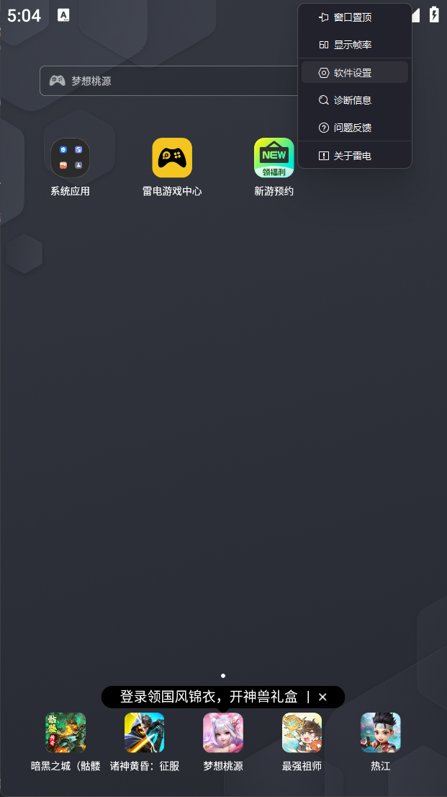
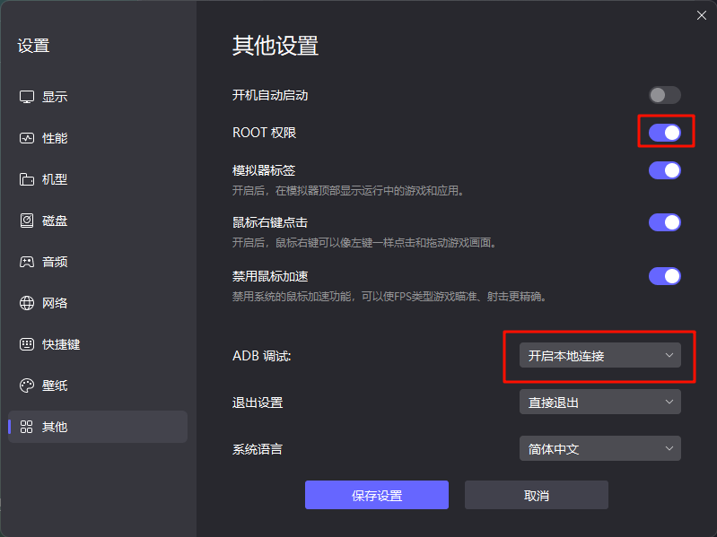
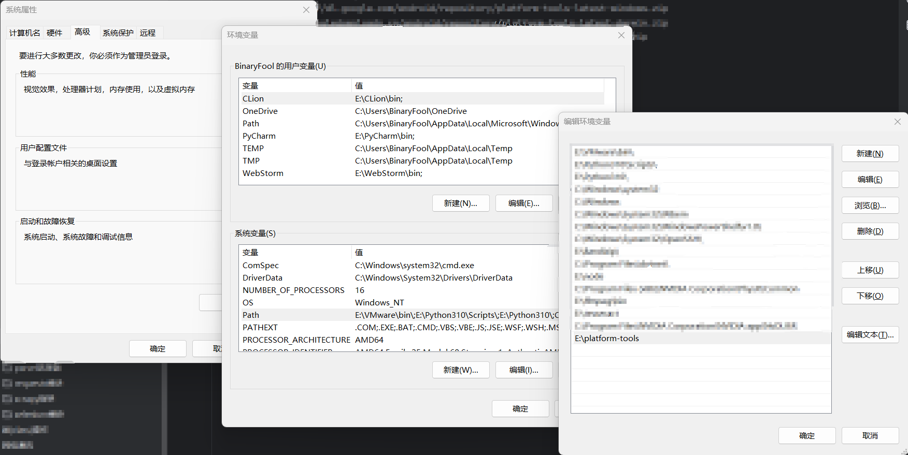
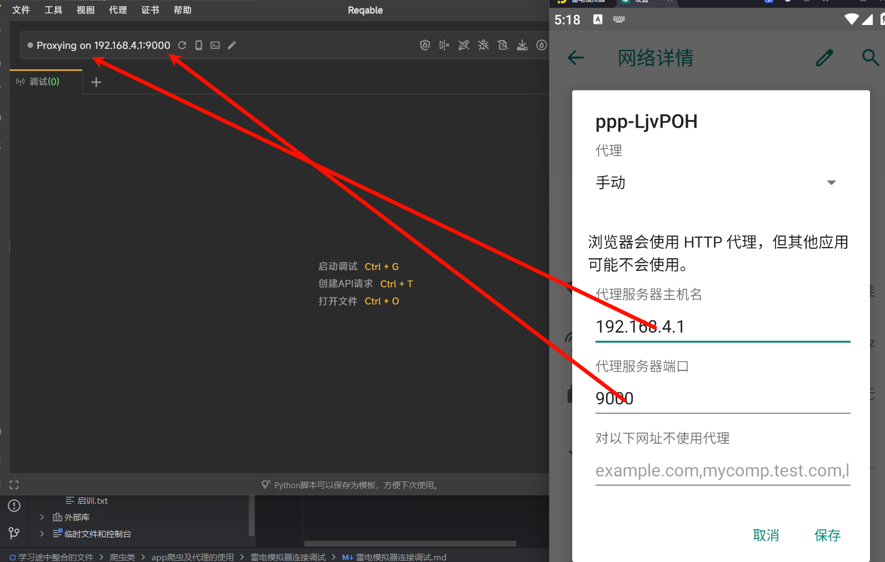
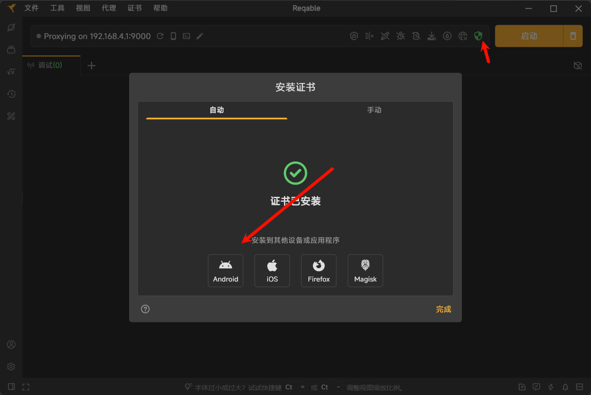
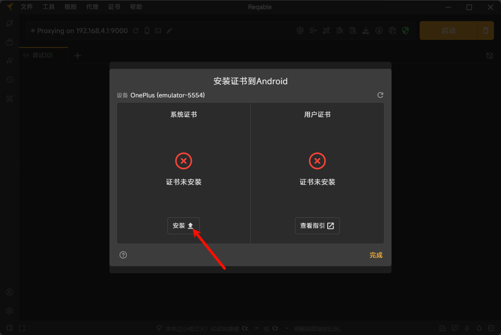

# 1.下载抓包工具

官网下载地址：https://reqable.com/

# 2.下载模拟器

雷电模拟器：https://www.ldmnq.com/

- 选Android9版本即可

# 3.开启模拟器root和ADB连接




# 4.配置ADB

## 简介

ADB 全称为 Android Debug Bridge，起到调试桥的作用，是一个**客户端-服务器端程序**。其中客户端是用来操作的电脑，服务端是 Android 设备。

ADB 也是 Android SDK 中的一个工具，可以直接操作管理 Android 或者真实的 Android 设备。

Google很好心，直接放出ADB的zip供人下载。路径如下：

Windows版本：https://dl.google.com/android/repository/platform-tools-latest-windows.zip

Mac版本：https://googledownloads.cn/android/repository/platform-tools-latest-darwin.zip

Linux版本：https://dl.google.com/android/repository/platform-tools-latest-linux.zip

## 添加到系统变量

**windows**



## 测试

**使用cmd进入命令面板**

- 查看 adb 版本,报错这未配置成功

```
adb version
```

# 5.使用ADB（可选，因为会自动处理）

**使用cmd进入命令面板**

- 查看设备端口信息

```
adb devices
```

- 连接设备

```
adb connect 127.0.0.1:5554
```

- 进入设备

```
adb -s emulator-5554 shell
```

**进入终端后可以执行一些你需要的命令**

# 6.配置雷电网络代理



# 7.配置证书




# 8.接下来启动 Reqable 即可进行抓包

# 9.扩展

推荐雷电模拟器，适配电脑cpu和主板更强：https://www.ldmnq.com/

Reqable是临时安装证书，下次启动模拟器就失效了，也需要先使用ADB连接上才能安装证书

可以抓去app的请求，有些无法抓取，需要退壳操作、加密（知识盲区，需要学很多）
