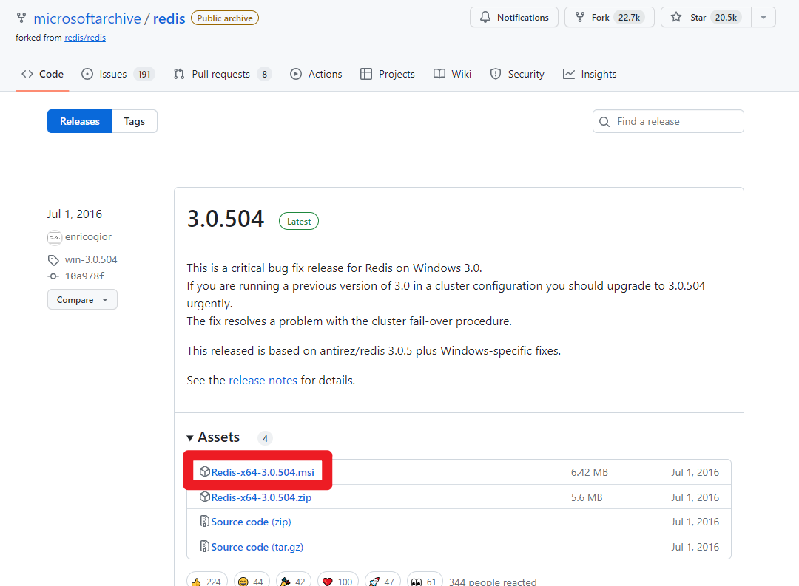
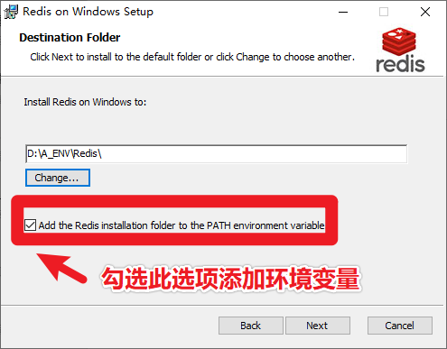
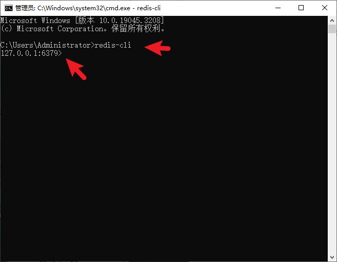
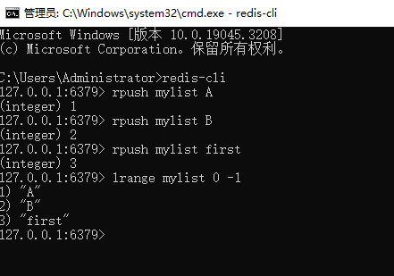
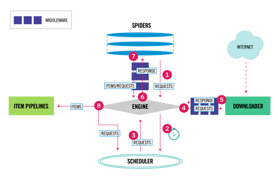
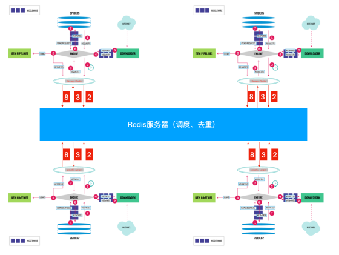

## 1、分布式概述

### 1、1 什么是分布式？

将一个任务分割成多份，每一份由一个计算机完成，最后所有的计算机能够成为一个整体，得到这个任务的结果。

分布式产生的原因：
原来一个数据库都是放在一台电脑上的，但是由于用户量的增多，造成数据库压力很大，所以产生一个思想，就是用多台电脑可以提供同样的数据库服务。

### 1、2 scrapy分布式：

原来的项目是部署在一台电脑上的，这样爬取速度虽然很快，但是我们还能提升，联想到分布式的思想，我们是否可以通过多台电脑进行配合爬取，这样我们的爬取速度就能大幅度提升。
分布式爬虫就是：【多台电脑爬取同一个项目】。

### 1、3 scrapy和scrapy-redis的区别：

（1）scrapy是一个爬虫框架，但是他不支持分布式。
（2）scrapy-redis，通过scrapy上增加一个redis组件，这个redis里面设置了带爬取url的列表和每个url的指纹集合，通过这两点，做到了分布式，使得多台电脑可以联合爬取一个任务。

## 2、Redis数据库及可视化工具安装

### 2、1 Redis是什么

**Redis**是一个由 Salvatore Sanfilippo 写的 key-value 存储系统。Redis 提供了一些丰富的数据结构，包括 lists、sets、ordered sets 以及 hashes ，当然还有和 Memcached 一样的 strings 结构。Redis 当然还包括了对这些数据结构的丰富操作。

### 2、2 安装Redis数据库

* windows

  * 安装包下载地址：https://github.com/microsoftarchive/redis/releases
  * 然后选择 **msi** 文件下载，双击安装

  

  > **下载完成后双击打开安装（安装过程中一定要添加到系统环境变量）**
  >
  > 
  >
  > cmd终端中输入**redis-cli**有如下效果表示安装配置成功
  >
  > 

* Linux
  * 直接输入命令 sudo apt-get install redis-server 。安装完成后，Redis服务器会自动启动。
    使用redis-cli 命令即可进入Redis数据库。

* Mac电脑请参考如下教程

  * https://blog.csdn.net/wto882dim/article/details/99684311

### 2、3 安装可视化工具

> windows系统下直接双击**RedisStudio-en-0.1.5.exe**即可免安装使用
>
> Mac系统参考上述链接教程

### 2、4 redis基本数据库语法

Redis 常被称作是一款数据结构服务器（data structure server）。Redis 的键值可以包括字符串（strings）类型，同时它还包括哈希（hashes）、列表（lists）、集合（sets）和 有序集合（sorted sets）等数据类型。

本课中需要用到列表（lists）操作，咱们来看看常用数据库指令：

* **lpush/rpush** 队列左边或者右边增加内容
* **lrange** 获取指定长度的内容

操作截图：



其中 **lpush/rpush** 是在列表中添加数据的指令，**mylist** 是列表的名字，后面是在列表中添加的数据。


## 3、分布式采集

> Scrapy_redis ： 基于Scrapy的Redis组件
>
> Github地址：https://github.com/rmax/scrapy-redis

Scrapy_redis 在scrapy 的基础上实现了更多，更强大的功能，具体体现在：reqeust去重，爬虫持久化，和轻松实现分布式

那么，scrapy_redis是如何帮助我们抓取数据的呢？

### 3、1 单机爬虫

默认情况下Scrapy是不支持分布式的，需要使用基于Redis 的 Scrapy-Redis 拓展组件才能实现分布式。

正常的 Scrapy 单机爬虫：



Scrapy并不会共享调度队列，也就是说Scrapy是不支持分布式的。为了支持分布式，我们需要让Scrapy支持共享调度队列，也就是改造成共享调度和去重的功能。

### 3、2 分布式爬虫

**分布式：分而治之**

将一个爬虫代码，分别部署在多台电脑上，共同完成整个爬虫任务。




使用Redis服务器来集中处理所有的请求，主要负责请求的去重和调度。通过这种方式，所有电脑端的爬虫共享了一个爬取队列，并且每个电脑端每次得到的请求都是其他爬虫未曾访问的。从而提高了爬虫效率。

得到一个请求之后，检查一下这个Request是否在Redis去重，如果在就证明其它的spider采集过啦！如果不在就添加进调度队列，等待别人获取。

Scrapy 是一个通用的爬虫框架，但是不支持分布式，Scrapy-redis是为了更方便地实现Scrapy分布式爬取，而提供了一些以redis为基础的组件。

安装如下：`pip install scrapy-redis`

Scrapy-redis 提供了下面四种组件（components）：(四种组件意味着这四个模块都要做相应的修改) 

1. Scheduler（调度器）
2. Duplication Filter（去重）
3. Item Pipeline（管道）
4. Base Spider（爬虫类）

#### Scheduler（调度器）

Scrapy改造了Python本来的collection.deque(双向队列)形成了自己的Scrapy queue，但是Scrapy多个spider不能共享待爬取队列Scrapy queue， 即Scrapy本身不支持爬虫分布式，scrapy-redis 的解决是把这个Scrapy queue换成redis数据库（也是指redis队列），便能让多个spider去同一个数据库里读取，这样实现共享爬取队列。

Redis支持多种数据结构，这些数据结构可以很方便的实现这样的需求：

- 列表有lpush()，lpop()，rpush()，rpop()，这些方法可以实现先进先出，或者先进后出式的爬取队列。

- 集合元素是无序且不重复的，可以很方便的实现随机排序且不重复的爬取队列。

- Scrapy的Request带有优先级控制，Redis中的集合也是带有分数表示的，可以用这个功能实现带有优先级调度的爬取队列。

  Scrapy把待爬队列按照优先级建立了一个字典结构，比如：

```json
{
    优先级0 : 队列0
    优先级1 : 队列1
    优先级2 : 队列2
}
```

然后根据request中的优先级，来决定该入哪个队列，出列时则按优先级较小的优先出列。由于Scrapy原来的Scheduler只能处理Scrapy自身的队列，不能处理Redis中的队列，所以原来的Scheduler已经无法使用，应该使用Scrapy-Redis的Scheduler组件。

#### Duplication Filter（去重）

Scrapy自带去重模块，该模块使用的是Python中的集合类型。该集合会记录每个请求的指纹，指纹也就是Request的散列值。指纹的计算采用的是hashlib的sha1()方法。计算的字段包含了，请求的Method，URL，Body，Header这几个内容，这些字符串里面只要里面有一点不同，那么计算出来的指纹就是不一样的。也就是说，计算的结果是加密后的字符串，这就是请求指纹。通过加密后的字符串，使得每个请求都是唯一的，也就是指纹是惟一的。并且指纹是一个字符串，在判断字符串的时候，要比判断整个请求对象容易。所以采用了指纹作为判断去重的依据。

Scrapy-Redis要想实现分布式爬虫的去重功能，也是需要更新指纹集合的，但是不能每个爬虫维护自己的单独的指纹集合。利用Redis集合的数据结构类型，可以轻松实现分布式爬虫的指纹判重。也就是说：每台主机得到Request的指纹去和Redis中的集合进行对比，如果指纹存在，说明是重复的，也就不会再去发送请求，如果不曾存在于Redis中的指纹集合，就会发送请求，并且将该指纹加入Redis的集合中。这样就实现了分布式爬虫的指纹集合的共享。

#### Item Pipeline

引擎将(Spider返回的)爬取到的Item给Item Pipeline，scrapy-redis 的Item Pipeline将爬取到的 Item 存⼊redis的 items queue。修改过Item Pipeline可以很方便的根据 key 从 items queue 提取item，从⽽实现 items processes集群。

#### Base Spider

不再使用scrapy原有的Spider类，重写的RedisSpider继承了Spider和RedisMixin这两个类，RedisMixin是用来从redis读取url的类。当我们生成一个Spider继承RedisSpider时，调用setup_redis函数，这个函数会去连接redis数据库，然后会设置signals(信号)：

当spider空闲时候的signal，会调用spider_idle函数，这个函数调用schedule_next_request函数，保证spider是一直活着的状态，并且抛出DontCloseSpider异常。

当抓到一个item时的signal，会调用item_scraped函数，这个函数会调用schedule_next_request函数，获取下一个request。

## 3、3 Scrapy_redis

1、clone github scrapy-redis源码文件 
	git clone https://github.com/rolando/scrapy-redis.git 
2、研究项目自带的三个demo
	mv scrapy-redis/example-project ~/scrapyredis-project

### domz

```python
# filename(spider):domz.py
from scrapy.linkextractors import LinkExtractor
from scrapy.spiders import CrawlSpider, Rule


class DmozSpider(CrawlSpider):
    """Follow categories and extract links."""
    name = 'dmoz'
    allowed_domains = ['dmoztools.net']
    start_urls = ['http://dmoztools.net/']

    rules = [
    	# 定义一个url提取规则，满足条件的url交给callback函数处理
        Rule(LinkExtractor(
            restrict_css=('.top-cat', '.sub-cat', '.cat-item')
        ), callback='parse_directory', follow=True),
    ]

    def parse_directory(self, response):
        for div in response.css('.title-and-desc'):
        	# 将结果返回给引擎
            yield {
                'name': div.css('.site-title::text').extract_first(),
                'description': div.css('.site-descr::text').extract_first().strip(),
                'link': div.css('a::attr(href)').extract_first(),
            }

```

domz这个部分与我们自己写的crawlspider没有任何区别

```python
# filename:settings.py
# Scrapy settings for example project
#
# For simplicity, this file contains only the most important settings by
# default. All the other settings are documented here:
#
#     http://doc.scrapy.org/topics/settings.html
#
SPIDER_MODULES = ['example.spiders']
NEWSPIDER_MODULE = 'example.spiders'

USER_AGENT = 'scrapy-redis (+https://github.com/rolando/scrapy-redis)'

# 指定去重方法
DUPEFILTER_CLASS = "scrapy_redis.dupefilter.RFPDupeFilter"
# 指定调度器
SCHEDULER = "scrapy_redis.scheduler.Scheduler"
# 队列中的内容是否持久保存，为False的时候在关闭爬虫时清空redis数据
SCHEDULER_PERSIST = True
#SCHEDULER_QUEUE_CLASS = "scrapy_redis.queue.SpiderPriorityQueue"
#SCHEDULER_QUEUE_CLASS = "scrapy_redis.queue.SpiderQueue"
#SCHEDULER_QUEUE_CLASS = "scrapy_redis.queue.SpiderStack"

ITEM_PIPELINES = {
    'example.pipelines.ExamplePipeline': 300,
    # scrapy_redis实现的items保存数据到 redis 的 pipeline
    'scrapy_redis.pipelines.RedisPipeline': 400,
}

LOG_LEVEL = 'DEBUG'

# Introduce an artifical delay to make use of parallelism. to speed up the
# crawl.
DOWNLOAD_DELAY = 1
# 配置数据库连接
REDIS_URL = "redis://127.0.0.1:6379"

## redis的地址可以写成如下形式
# REDIS_HOST = "127.0.0.1"
# REDIS_PORT = 6379
```

我们执行domz的爬虫，会发现redis中多了一下三个键

我们可以尝试在setting中关闭redispipeline，

观察redis中三个键的存储数据量的变化

变化结果：
	dmoz:requests 有变化(变多或者变少或者不变)
	dmoz:dupefilter 变多
	dmoz:items 不变

变化结果分析:
	redispipeline中仅仅实现了item数据存储到redis的过程，我们可以新建一个pipeline（或者修改默认的ExamplePipeline），让数据存储到任意地方

那么问题来了：以上的这些功能scrapy_redis都是如何实现的呢？

### RedisPipeline

```python
class RedisPipeline(object):
	
	...
    
    # 使用 process_item 的方法，实现数据保存
    def process_item(self, item, spider):
        return deferToThread(self._process_item, item, spider)

    def _process_item(self, item, spider):
        key = self.item_key(item, spider)
        data = self.serialize(item)
        # 向 dmoz:item 中添加 item
        self.server.rpush(key, data)
        return item

    def item_key(self, item, spider):
        return self.key % {'spider': spider.name}
```

### RFPDupeFilter

```python
# filename:scrapy_redis/dupeFilter.py
import logging
import time

from scrapy.dupefilters import BaseDupeFilter
from scrapy.utils.request import request_fingerprint


class RFPDupeFilter(BaseDupeFilter):


    def request_seen(self, request):
        """判断 request 对象是否已经存在"""
        fp = self.request_fingerprint(request)
        # 添加到dupefilter中，返回 0 表示数据已经存在
        added = self.server.sadd(self.key, fp)
        return added == 0

    def request_fingerprint(self, request):
        return request_fingerprint(request)
```


```python
# filename:scrapy/utils/request.py
def request_fingerprint(request, include_headers=None):
  
    if include_headers:
        include_headers = tuple(to_bytes(h.lower())
                                 for h in sorted(include_headers))
    cache = _fingerprint_cache.setdefault(request, {})
    if include_headers not in cache:
        # sha1 加密
        fp = hashlib.sha1()
        fp.update(to_bytes(request.method))
        fp.update(to_bytes(canonicalize_url(request.url)))
        fp.update(request.body or b'')
        # 添加请求头，默认不加请求头（因为headers的cookies中含有session_id,这在不同的网站中是随机的，会给sha1带来误差）
        if include_headers:
            for hdr in include_headers:
                if hdr in request.headers:
                    fp.update(hdr)
                    for v in request.headers.getlist(hdr):
                        fp.update(v)
        # 返回加密之后的16进制
        cache[include_headers] = fp.hexdigest()
    return cache[include_headers]

```

#### 去重方法

- 使用sha1加密request得到指纹
- 把指纹存在redis的集合中
- 下一次新来一个request，同样的方式生成指纹，判断指纹是否存在reids的集合中

#### 生成指纹

```python
fp = hashlib.sha1()
fp.update(to_bytes(request.method))  #请求方法
fp.update(to_bytes(canonicalize_url(request.url))) #url
fp.update(request.body or b'')  #请求体
return fp.hexdigest()
```

#### Scheduler

```python
# filename:scrapy_redis/dupeFilter.py
class Scheduler(object):


    def close(self, reason):
        # 如果在settings中设置不持久，那么在退出时候就会清空
        if not self.persist:
            self.flush()

    def flush(self):
        # 存放 dupefilter 的 redis
        self.df.clear()
        # 存放 request 的 redis
        self.queue.clear()

    def enqueue_request(self, request):
        # 不能加入带爬取队列的条件，当 url 需要经过 allow_domain 过滤并且 request 不存在 dp 的时候
        if not request.dont_filter and self.df.request_seen(request):
            self.df.log(request, self.spider)
            return False
        if self.stats:
            self.stats.inc_value('scheduler/enqueued/redis', spider=self.spider)
        self.queue.push(request)
        return True

```

#### request入队

- dont_filter = True ,构造请求的时候，把dont_filter置为True，该url会被反复抓取（url地址对应的内容会更新的情况）
- 一个全新的url地址被抓到的时候，构造request请求
- url地址在start_urls中的时候，会入队，不管之前是否请求过
  - 构造start_url地址的请求时候，dont_filter = True

```python
def enqueue_request(self, request):
    if not request.dont_filter and self.df.request_seen(request):
        # 去重（True）      指纹已经存在（True） not True 提前返回，不会放入队列
        # 不去重（False）   指纹已经存在（True） not False 放入队列
        # 去重（True）      指纹不存在（True）   not False 放入队列
        self.df.log(request, self.spider)
        return False
    self.queue.push(request) #入队
    return True
```

通过以上知识点的学习，我们会发现：

* domz相比于之前的spider多了持久化和request去重的功能
* 在之后的爬虫中，我们可以模仿domz的用法，使用scrapy_redis实现相同的功能

注意：setting中的配置都是可以自己设定的，意味着我们的可以重写去重和调度器的方法，包括是否要把数据存储到redis(pipeline)

配置文件：

```python
# 修改调度器
SCHEDULER = "scrapy_redis.scheduler.Scheduler"
# 修改去重工具
DUPEFILTER_CLASS = "scrapy_redis.dupefilter.RFPDupeFilter"
# 开启数据持久化
SCHEDULER_PERSIST = True
REDIS_HOST = '127.0.0.1'
REDIS_PORT = 6379
# 验证数据库密码
REDIS_PARAMS = {
    'password': '123456',
}
```

