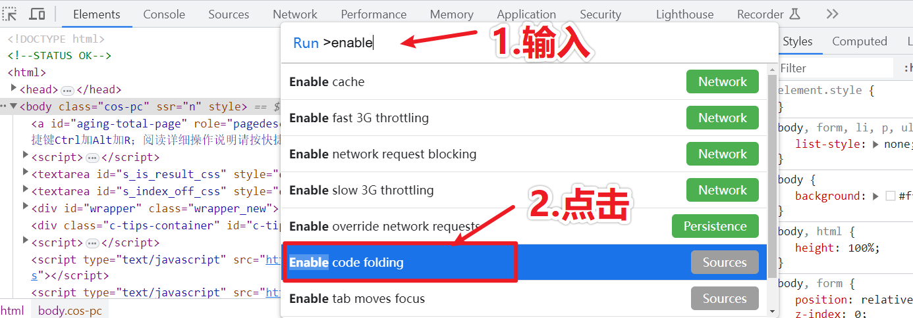

## 1、前言

我们所说的加密方式，都是对二进制编码的格式进行加密的，对应到Python中，则是我们的`Bytes`。

所以当我们在Python中进行加密操作的时候，要确保我们操作的是`Bytes`，否则就会报错。

### 1、字符串操作

#### 1、1 编码与解码

将字符串和`Bytes`互相转换可以使用`encode()`和`decode()`方法。如下所示：

```python
# 方法中不传参数则是以默认的utf-8编码进行转换
a = "中国欢迎您".encode("utf-8")
print(a)  # b'\xe4\xb8\xad\xe5\x9b\xbd\xe6\xac\xa2\xe8\xbf\x8e\xe6\x82\xa8'

b = a.decode("utf-8")
print(b)  # 中国欢迎您
```

#### 1、2 进制转化

利用`binascii`模块可以将十六进制显示的字节转换成我们在加解密中更常用的显示方式：

```python
import binascii

# 二进制到十六进制
c = binascii.b2a_hex('中国欢迎您'.encode())
print("c", c)  # b'e4b8ade59bbde6aca2e8bf8ee682a8'

# 十六进制到二进制
d = binascii.a2b_hex(c)
print(d)  # b'\xe4\xb8\xad\xe5\x9b\xbd\xe6\xac\xa2\xe8\xbf\x8e\xe6\x82\xa8'

v = binascii.a2b_hex(c).decode("utf-8")
print(v)  # 中国欢迎您
```

> 需要注意的是中文编码采用的是16进制的表达形式，类似于**`\x`** 这样表达

### 2、URL编码 

#### **2、1 简介**

正常的URL中是只能包含ASCII字符的，也就是字符、数字和一些符号。而URL编码就是一种浏览器用来避免url中出现特殊字符（如汉字）的编码方式。其实就是将超出ASCII范围的字符转换成带`%`的十六进制格式。

#### **2、2 Python实现**

```python
from urllib import parse

# 编码
a = parse.quote("中国欢迎您")
print(a)  # %E4%B8%AD%E5%9B%BD%E6%AC%A2%E8%BF%8E%E6%82%A8

# 解码
b = parse.unquote(a)
print(b)  # 中国欢迎您
```

### 3、Unicode编码

#### 3、1 简介

unicode编码我们又可以叫做是统一码。在计算机科学领域中是一中业界标准，unicode编码还包含了字符集、编码方案等等。unicode编码给每个字符提供了一个唯一的数字，不论是什么平台、不论是什么程序、不论是什么语言。unicode编码的出现是为力更好的解决传统字符在编码产生的局此案问题。并且unicode编码给每种语言中的每个字符设定了统一并且唯一的二进制编码。

#### 3、2 编码说明

Unicode的表现方式是U+XXXXXX，X代表一位十六进制数，可以有4-6位，不足 4 位前补 0 补足 4 位，超过则按是几位就是几位。

字符A的ASCII码是65，将65转换成16进制就是41（16×4+（16^0)×1 = 65）,按照规则前面补0，那么字符A的Unicode表示就是U+0041，依次类推B的Unicode表示就是U+0042...等等，汉字"爱"的字符表示是“U+7231”

#### 3、3 Unicode编码的转化

~~~python
def unicode_to_str(unicode_str):
    """unicode转字符串"""
    return unicode_str.encode().decode('unicode_escape')


def str_to_unicode(string):
    """字符串转Unicode"""
    new_str = ''
    for ch in string:
        if '\u4e00' <= ch <= '\u9fff':
            new_str += hex(ord(ch))
            new_str = new_str.replace('0x', '\\u')
        else:
            new_str += ch
    return new_str


if __name__ == '__main__':
    result = str_to_unicode('你好')

    print(result)  # \u4f60\u597d
    print(repr(result))  # '\\u4f60\\u597d'
    print(unicode_to_str('\\u4f60\\u597d'))  # 你好
~~~

### 3、Base64编码

#### **3、1 简介**

Base64是一种用64个字符来表示任意二进制数据的方法。

Base64编码可以成为密码学的基石。可以将任意的二进制数据进行Base64编码。所有的数据都能被编码为并只用65个字符就能表示的文本文件。（ 65字符：A~Z a~z 0~9 + / = ）编码后的数据~=编码前数据的4/3，会大1/3左右。

#### **3、2 Base64编码的原理**


1. 将所有字符转化为ASCII码。
2. 将ASCII码转化为8位二进制 。
3. 将二进制3个归成一组(不足3个在后边补0)共24位，再拆分成4组，每组6位。
4. 统一在6位二进制前补两个0凑足8位。
5. 将补0后的二进制转为十进制。
6. 从Base64编码表获取十进制对应的Base64编码。

#### **3、3 Base64编码的说明**

1. 转换的时候，将三个byte的数据，先后放入一个24bit的缓冲区中，先来的byte占高位。
2. 数据不足3byte的话，于缓冲区中剩下的bit用0补足。然后，每次取出6个bit，按照其值选择查表选择对应的字符作为编码后的输出。
3. 不断进行，直到全部输入数据转换完成。
4. 如果最后剩下两个输入数据，在编码结果后加1个“=”。
5. 如果最后剩下一个输入数据，编码结果后加2个“=”。
6. 如果没有剩下任何数据，就什么都不要加，这样才可以保证资料还原的正确性。

#### **3、4 Python的Base64使用**

Python内置的`base64`模块可以直接进行base64的编解码

**注意：用于base64编码的，要么是ASCII包含的字符，要么是二进制数据**

```python
import base64

# 编码
a = base64.b64encode(b"hello world")
print(a)  # b'aGVsbG8gd29ybGQ='

# 解码
b = base64.b64decode(a)
print(b)  # b"hello world"
```

#### **3、5 Base64格式的文件**

在前端中，有很多文件也被编辑成base的文件，像我们之前看到过的有图片，字体文件等。使用这种格式的原因是在传递数据的时候方便传递，也便于还原数据。

### 4、MD5（信息-摘要算法）

#### **4、1 简述**

message-digest algorithm 5（信息-摘要算法）。经常说的“MD5加密”，就是它→信息-摘要算法。

md5，其实就是一种算法。可以将一个字符串，或文件，或压缩包，执行md5后，就可以生成一个固定长度为128bit 的串。这个串，基本上是唯一的。

#### **4、2不可逆性** 

每个人都有不同的指纹，看到这个人，可以得出他的指纹等信息，并且唯一对应，但你只看一个指纹，是不可能看到或读到这个人的长相或身份等信息。

#### **4、3 特点** 

1. 压缩性：任意长度的数据，算出的MD5值长度都是固定的。
2. 容易计算：从原数据计算出MD5值很容易。
3. 抗修改性：对原数据进行任何改动，哪怕只修改1个字节，所得到的MD5值都有很大区别。
4. 强抗碰撞：已知原数据和其MD5值，想找到一个具有相同MD5值的数据（即伪造数据）是非常困难的。

举个栗子：我从树下捡了一片叶子，全世界有数不清的树叶，我就想整个世界会不会有一片完全一样的叶子? 以一片有限的叶子对世界上无限的树叶，这个理论上的确是可以找到一片完全的叶子，可是实际情况下很难很难找到。

#### **4、4 Python的MD5使用**

由于MD5模块在python3中被移除，在python3中使用`hashlib`模块进行md5操作

```python
import hashlib

# 待加密信息
str = '中国你好'

# 创建md5对象，
# md5对象，md5不能反解，但是加密是固定的，就是关系是一一对应，所以有缺陷，可以被对撞出来
hl = hashlib.md5()

# 要对哪个字符串进行加密，就放这里
# 此处必须声明encode
# 若写法为hl.update(str)  报错为： Unicode-objects must be encoded before hashing
hl.update(str.encode(encoding='utf-8'))

print('MD5加密前为 ：' + str)
# hl.hexdigest()) #拿到加密字符串
print('MD5加密后为 ：' + hl.hexdigest())

"""
MD5加密前为 ：中国你好
MD5加密后为 ：560a6b11a85d436acfa4bd7f34462f40
"""

hash3 = hashlib.md5(bytes('abd', encoding='utf-8'))
''' 
如果没有参数，所以md5遵守一个规则，生成同一个对应关系，如果加了参数，
就是在原先加密的基础上再加密一层，这样的话参数只有自己知道，防止被撞库，
因为别人永远拿不到这个参数
'''
hash3.update(bytes("admin", encoding="utf-8"))
print(hash3.hexdigest())  # 9aea3c0a6c51555c1a4d0a5e9b689ded

```

MD5不仅仅是上面这个例子这样用来处理字符串，还有更广泛的用途：

- 加密网站注册用户的密码。 （但去年的各大网站密码泄漏事件确实让人蛋疼……）
- 网站用户上传图片 / 文件后，计算出MD5值作为文件名。（MD5可以保证唯一性）
- key-value数据库中使用MD5值作为key。
- 比较两个文件是否相同。（大家在下载一些资源的时候，就会发现网站提供了MD5值，就是用来检测文件是否被篡改）
- ……

**处理大文件：**

上面说过可以用MD5来检测两个文件是否相同，但想想，如果是两个很大的文件，担心内存不够用，这时怎么办？

这就要使用 update 方法了。代码如下：

```python
import hashlib
 
def get_file_md5(f):
    m = hashlib.md5()
 
    while True:
        data = f.read(10240)
        if not data:
            break
 
        m.update(data)
    return m.hexdigest()
 
 
with open(YOUR_FILE, 'rb') as f:
    file_md5 = get_file_md5(f)
```

以上的加密算法虽然非常厉害，但还是存在缺陷，即：通过撞库可以反解，所以，有必要对加密算法中添加自定义key再来做加密

#### **4、5 MD5长度**

md5的长度，默认为128bit，也就是128个0和1的二进制串。这样表达是很不友好的。所以将二进制转成了16进制，每4个bit表示一个16进制，所以128/4 = 32 换成16进制表示后，为32位了。

为什么网上还有md5是16位的呢？

其实16位的长度，是从32位md5值来的。是将32位md5去掉前八位，去掉后八位得到的。

#### **4、6 sha1 加密**

SHA1的全称是Secure Hash Algorithm(安全哈希算法) 。SHA1基于MD5，加密后的数据长度更长，

它对长度小于264的输入，产生长度为160bit的散列值。比MD5多32位。

因此，比MD5更加安全，但SHA1的运算速度就比MD5要慢了。

```python
import hashlib
 
str = "中国你好"
a = hashlib.sha1(str.encode("utf-8")).hexdigest()
print("sha1加密前为 ：",str)
print("sha1加密前后 ：",a)
 
"""
sha1加密前为 ： 中国你好
sha1加密前后 ： 3e6c570876775d0031dbf66247ed1054d4ef695e
"""
```

### 5、PyCryptodome

PyCrypto是 Python 中密码学方面最有名的第三方软件包。可惜的是，它的开发工作于2012年就已停止。

幸运的是，有一个该项目的分支 PyCrytodome 取代了 PyCrypto 。

#### 5、1 安装与导入 

* 在Windows 系统上安装：

  ~~~
  pip install pycryptodomex
  ~~~

  导入：

  ~~~
  import Cryptodome
  ~~~

* 在Linux上安装，可以使用以下 pip 命令：

  ~~~
  pip install pycryptodome
  ~~~

  导入：

  ~~~
  import Crypto
  ~~~

#### 5、2 DES

 **1)简介**

DES算法为密码体制中的对称密码体制，又被称为美国数据加密标准。

DES是一个分组加密算法，典型的DES以64位为分组对数据加密，加密和解密用的是同一个算法。

DES算法的入口参数有三个：Key、Data、Mode。其中Key为7个字节共56位，是DES算法的工作密钥；Data为8个字节64位，是要被加密或被解密的数据；Mode为DES的工作方式,有两种:加密或解密。

密钥长64位，密钥事实上是56位参与DES运算（第8、16、24、32、40、48、56、64位是校验位，使得每个密钥都有奇数个1），分组后的明文组和56位的密钥按位替代或交换的方法形成密文组。

算法步骤 
1）初始置换 
其功能是把输入的64位数据块按位重新组合,并把输出分为L0、R0两部分,每部分各长3 2位,其置换规则为将输入的第58位换到第一位,第50位换到第2位……依此类推,最后一位是原来的第7位。L0、R0则是换位输出后的两部分，L0是输出的左32位,R0是右32位,例:设置换前的输入值为D1D2D3……D64,则经过初始置换后的结果为:L0=D58D50……D8;R0=D57D49……D7。 
其置换规则见下表： 
58,50,42,34,26,18,10,2,60,52,44,36,28,20,12,4, 
62,54,46,38,30,22,14,6,64,56,48,40,32,24,16,8, 
57,49,41,33,25,17,9,1,59,51,43,35,27,19,11,3, 
61,53,45,37,29,21,13,5,63,55,47,39,31,23,15,7, 
2）逆置换 
经过16次迭代运算后,得到L16、R16,将此作为输入,进行逆置换,逆置换正好是初始置换的逆运算，由此即得到密文输出。 
此算法是对称加密算法体系中的代表,在计算机网络系统中广泛使用.

加密和解密的过程

```python
# 导入DES模块
from Cryptodome.Cipher import DES
import binascii
 
# 这是密钥,此处需要将字符串转为字节
key = b'abcdefgh'
 
# 需要去生成一个DES对象
def pad(text):
     """
       # 加密函数，如果text不是8的倍数【加密文本text必须为8的倍数！】，那就补足为8的倍数
        :param text:
        :return:
     """
     while len(text) % 8 != 0:
        text += ' '
     return text
 
# 创建一个DES实例
des = DES.new(key,DES.MODE_ECB)
text ="I'm china!"
padded_text = pad(text)
print(padded_text)
#加密
encrypted_text = des.encrypt(padded_text.encode("utf-8"))
print(encrypted_text)
# rstrip(' ')返回从字符串末尾删除所有字符串的字符串(默认空白字符)的副本
 
# 解密
plain_text = des.decrypt(encrypted_text).decode().rstrip(' ')
print(plain_text)
 
"""
I'm china!      
b'\xc0`I\x15\x8bo\x00\x00\xb0\xe27\xfe)\xc3\xde,'
I'm china!
"""

```

```python
# 导入DES模块
from Cryptodome.Cipher import DES
import binascii
 
# 这是密钥
key = b'abcdefgh'
# 需要去生成一个DES对象
des = DES.new(key, DES.MODE_ECB)
# 需要加密的数据
text = 'python spider!'
text = text + (8 - (len(text) % 8)) * '='
# 加密的过程
encrypto_text = des.encrypt(text.encode())
# 加密过后二进制转化为ASCII 
encrypto_text = binascii.b2a_hex(encrypto_text)
print(encrypto_text)
# 解密需要ASCII 先转化为二进制 然后再进行解密
plaint = des.decrypt(binascii.a2b_hex(encrypto_text))
print(plaint)
 
"""
b'084725d8f5ffafc61814fae0796bfd2f'
b'python spider!=='
"""

```

#### 5、3 3DES 

3DES（或称为Triple DES）是三重数据加密算法（TDEA，Triple Data Encryption Algorithm）块密码的通称。它相当于是对每个数据块应用三次DES加密算法。

由于计算机运算能力的增强，原版DES密码的密钥长度变得容易被暴力破解。3DES即是设计用来提供一种相对简单的方法，即通过增加DES的密钥长度来避免类似的攻击，而不是设计一种全新的块密码算法。

3DES（即Triple DES）是DES向AES过渡的加密算法（1999年，NIST将3-DES指定为过渡的加密标准），加密算法，其具体实现如下：设Ek()和Dk()代表DES算法的加密和解密过程，K代表DES算法使用的密钥，M代表明文，C代表密文，这样：

3DES加密过程为：C=Ek3(Dk2(Ek1(M)))

3DES解密过程为：M=Dk1(EK2(Dk3(C)))

#### 5、4 AES 

**1）简介**

高级加密标准（英语：Advanced Encryption Standard，缩写：AES），在密码学中又称Rijndael加密法，是美国联邦政府采用的一种区块加密标准。这个标准用来替代原先的DES，已经被多方分析且广为全世界所使用。经过五年的甄选流程，高级加密标准由美国国家标准与技术研究院（NIST）于2001年11月26日发布于FIPS PUB 197，并在2002年5月26日成为有效的标准。2006年，高级加密标准已然成为对称密钥加密中最流行的算法之一。

AES在软件及硬件上都能快速地加解密，相对来说较易于实作，且只需要很少的存储器。作为一个新的加密标准，目前正被部署应用到更广大的范围。
特点与思想：抵抗所有已知的攻击。 在多个平台上速度快，编码紧凑。 设计简单。 


AES为分组密码，分组密码也就是把明文分成一组一组的，每组长度相等，每次加密一组数据，直到加密完整个明文。在AES标准规范中，分组长度只能是128位，也就是说，每个分组为16个字节（每个字节8位）。密钥的长度可以使用128位、192位或256位。密钥的长度不同，推荐加密轮数也不同。

一般常用的是128位

```python
from Cryptodome.Cipher import AES
from Cryptodome import Random
 
from binascii import a2b_hex
 
# 要加密的明文
data = '南来北往'
# 密钥key必须为 16（AES-128）， 24（AES-192）， 32（AES-256）
key = b'this is a 16 key'
# 生成长度等于AES 块大小的不可重复的密钥向量
iv = Random.new().read(AES.block_size)
print(iv)
# 使用 key 和iv 初始化AES 对象， 使用MODE_CFB模式
mycipher = AES.new(key, AES.MODE_CFB, iv)
print(mycipher)
# 加密的明文长度必须为16的倍数， 如果长度不为16的倍数， 则需要补足为16的倍数
# 将iv(密钥向量)加到加密的密钥开头， 一起传输
ciptext = iv + mycipher.encrypt(data.encode())
# 解密的话需要用key 和iv 生成的AES对象
print(ciptext)
mydecrypt = AES.new(key, AES.MODE_CFB, ciptext[:16])
# 使用新生成的AES 对象， 将加密的密钥解密
decrytext = mydecrypt.decrypt(ciptext[16:])
 
print(decrytext.decode())
```

##### 5、4、1 ECB模式

ECB模式（电子密码本模式：Electronic codebook）

ECB是最简单的块密码加密模式，加密前根据加密块大小（如AES为128位）分成若干块，之后将每块使用相同的密钥单独加密，解密同理。


**优缺点**

ECB模式作为一种基本工作模式，具有操作简单，易于实现的特点。同时由于其分组的独立性，利于实现并行处理，并且能很好地防止误差传播。

另一方面由于所有分组的加密方式一致，明文中的重复内容会在密文中有所体现，因此难以抵抗统计分析攻击。

因此，ECB模式一般只适用于小数据量的字符信息的安全性保护，例如密钥保护。

##### 5、4、2 CBC模式

CBC模式（密码分组链接：Cipher-block chaining）

CBC模式对于每个待加密的密码块在加密前会先与前一个密码块的密文异或然后再用加密器加密。第一个明文块与一个叫初始化向量的数据块异或。


##### 5、4、3 计算器模式

计算器模式（Counter (CTR)）

计算器模式不常见，在CTR模式中，
有一个自增的算子，这个算子用密钥加密之后的输出和明文异或的结果得到密文，相当于一次一密。这种加密方式简单快速，安全可靠，而且可以并行加密，但是在计算器不能维持很长的情况下，密钥只能使用一次。CTR的示意图如下所示：


##### 5、4、4 密码反馈模式

密码反馈模式（Cipher FeedBack (CFB)）

与ECB和CBC模式只能够加密块数据不同，CFB能够将块密文（Block Cipher）转换为流密文（Stream Cipher）。


注意:CFB、OFB和CTR模式中解密也都是用的加密器而非解密器。
CFB的加密工作分为两部分：

将一前段加密得到的密文再加密；
将第1步加密得到的数据与当前段的明文异或。
由于加密流程和解密流程中被块加密器加密的数据是前一段密文，因此即使明文数据的长度不是加密块大小的整数倍也是不需要填充的，这保证了数据长度在加密前后是相同的。

#### 5、5 RSA 

使用之前需要安装 rsa 模块

```
pip install rsa
```

##### 5、5、1 应用场景

在公开密钥加密和电子商业中RSA被广泛使用。

该算法基于一个十分简单的数论事实：将两个大素数相乘十分容易，但那时想要对其乘积进行因式分解却极其困难，因此可以将乘积公开作为加密密钥，即公钥，而两个大素数组合成私钥。公钥是可发布的供任何人使用，私钥则为自己所有，供解密之用

##### 5、5、2 非对称加密算法

1、乙方生成两把密钥（公钥和私钥）。公钥是公开的，任何人都可以获得，私钥则是保密的。

2、甲方获取乙方的公钥，然后用它对信息加密。

3、乙方得到加密后的信息，用私钥解密。

##### 5、5、3 RSA算法

1977年，三位数学家Rivest、Shamir 和 Adleman 设计了一种算法，可以实现非对称加密。这种算法用他们三个人的名字命名，叫做RSA算法。从那时直到现在，RSA算法一直是最广为使用的"非对称加密算法"。毫不夸张地说，只要有计算机网络的地方，就有RSA算法。

这种算法非常可靠，密钥越长，它就越难破解。根据已经披露的文献，目前被破解的最长RSA密钥是768个二进制位。也就是说，长度超过768位的密钥，还无法破解（至少没人公开宣布）。因此可以认为，1024位的RSA密钥基本安全，2048位的密钥极其安全。

##### 5、5、4 数学基础

**互质关系**

如果两个正整数，除了1以外，没有其他公因子，我们就称这两个数是互质关系（coprime）。比如，15和32没有公因子，所以它们是互质关系。这说明，不是质数也可以构成互质关系。

关于互质关系，不难得到以下结论：

1. 任意两个质数构成互质关系，比如13和61。

2. 一个数是质数，另一个数只要不是前者的倍数，两者就构成互质关系，比如3和10。

3. 如果两个数之中，较大的那个数是质数，则两者构成互质关系，比如97和57。

4. 1和任意一个自然数是都是互质关系，比如1和99。

5. p是大于1的整数，则p和p-1构成互质关系，比如57和56。

6. p是大于1的奇数，则p和p-2构成互质关系，比如17和15。

**欧拉函数**

请思考以下问题：

任意给定正整数n，请问在小于等于n的正整数之中，有多少个与n构成互质关系？（比如，在1到8之中，有多少个数与8构成互质关系？）

计算这个值的方法就叫做欧拉函数，以φ(n)表示。在1到8之中，与8形成互质关系的是1、3、5、7，所以 φ(n) = 4。

φ(n) 的计算方法并不复杂，但是为了得到最后那个公式，需要一步步讨论。

##### 5、5、5 密钥生成

我们通过一个例子，来理解RSA算法。假设爱丽丝要与鲍勃进行加密通信，她该怎么生成公钥和私钥呢？


- 第一步，随机选择两个不相等的质数p和q。

爱丽丝选择了61和53。（实际应用中，这两个质数越大，就越难破解。）

- 第二步，计算p和q的乘积n。

爱丽丝就把61和53相乘。

n = 61×53 = 3233

n的长度就是密钥长度。3233写成二进制是110010100001，一共有12位，所以这个密钥就是12位。实际应用中，RSA密钥一般是1024位，重要场合则为2048位。

- 第三步，计算n的欧拉函数φ(n)。

根据公式：

φ(n) = (p-1)(q-1)

爱丽丝算出φ(3233)等于60×52，即3120。

- 第四步，随机选择一个整数e，条件是1< e < φ(n)，且e与φ(n) 互质。

爱丽丝就在1到3120之间，随机选择了17。（实际应用中，常常选择65537。）

- 第五步，计算e对于φ(n)的模反元素d。

所谓"模反元素"就是指有一个整数d，可以使得ed被φ(n)除的余数为1。

ed ≡ 1 (mod φ(n))

这个式子等价于

ed - 1 = kφ(n) (k∈Z)

于是，找到模反元素d，实质上就是对下面这个二元一次方程求解。

ex + φ(n)y = 1

已知 e=17, φ(n)=3120，

17x + 3120y = 1

这个方程可以用"扩展欧几里得算法"求解，此处省略具体过程。总之，爱丽丝算出一组整数解为 (x,y)=(2753,-15)，即 d=2753。

至此所有计算完成。

- 第六步，将n和e封装成公钥，n和d封装成私钥。

在爱丽丝的例子中，n=3233，e=17，d=2753，所以公钥就是 (3233,17)，私钥就是（3233, 2753）。

- 总结，实际上就是计算n,e,d的过程

pq的作用用于求n==pq，再用 (p-1)(q-1)求φ(n)，在φ(n)范围内随机选择即为e，d==e对于φ(n)的模反元素

##### 5、5、6 代码案例

```python
import rsa


class Rsa(object):
	"""RSA加密、解密"""

	def __init__(self, number, pub_path='public_key.pem', priv_path='private_key.pem'):
		"""
		设置公钥私钥存储路径
		:param pub_path: the path to public key, default its path is public_key.pem
		:param priv_path: the path to private key, default its path is private_key.pem
		"""
		# Generate the public and private keys, and returns them
		self.public_key, self.private_key = rsa.newkeys(number)

		self.public_key_path = pub_path
		self.private_key_path = priv_path

	def key_transform_store(self):
		"""
		保存公钥私钥
		:return: None
		"""
		pub = self.public_key.save_pkcs1()
		pri = self.private_key.save_pkcs1('PEM')
		
		with open(self.public_key_path, mode='wb') as f:
			f.write(pub)

		with open(self.private_key_path, mode='wb') as f1:
			f1.write(pri)

	def encry(self, info):
		"""
		rsa加密
		:param info: 需要加密的内容
		:return:加密后的结果
		"""
		with open(self.public_key_path, mode='rb') as f:
			pub = f.read()
			public_key = rsa.PublicKey.load_pkcs1(pub)

		info_encrypted = rsa.encrypt(info.encode('utf-8'), public_key)
		return info_encrypted

	def decry(self, info_encrypted):
		"""
		rsa解密
		:param info_encrypted: 要解密的内容
		:return: info
		"""
		with open(self.private_key_path, 'rb') as f:
			pri = f.read()
			private_key = rsa.PrivateKey.load_pkcs1(pri)

		msg = rsa.decrypt(info_encrypted, private_key)
		info = msg.decode('utf-8')  # decode
		return info


rsa_obj = Rsa(1024)  # 实例化
rsa_obj.key_transform_store()  # 
info_encrypted = rsa_obj.encry('我是真心喜欢你的。')  # 加密
print(info_encrypted)
info = rsa_obj.decry(info_encrypted)  # 解密
print(info)  # 我是真心喜欢你的。
```

> 注意事项:
>
> 1.RSA密钥至少为500位长，一般推荐使用1024位。RSA密钥长度随着保密级别提高，增加很快。
> 2.由于RSA的特性，一个1024位的密钥只能加密117位字节数据，当数据量超过117位字节的时候，程序就会抛出异常。

### 6、python调用JavaScript代码

​		如果想用python代码直接调用js的代码，则需要搭建js环境，并安装相关的库直接调用JS代码。**PyExecJS**就是其中一个比较好的库。可以使用 python 运行 JavaScript 代码。

但是这个库已经不再维护了，如果因为版本更新所导致的一些错误是无法修复的。

* PyExecJS 的优点是不需要关心 JavaScript 环境。 特别是它可以在 Windows 环境下工作，而不需要安装额外的库。
* 缺点之一是性能。 通过文本传递 JavaScript 运行时，速度很慢。 另一个缺点是它不完全支持运行时特定的特性。

**安装**

先安装`nodejs`环境，在安装 python 库。

~~~
pip install pyexecjs
~~~

**使用**

* execjs.compile()

  编译js，括号内部传js的语法

* obj.call()
  调用js方法，obj表示编译好的js对象，call方法内部传js中需要调用的函数，和调用函数所需参数。

### 附录：chrome调试功能设置

#### 设置代码折叠

* 在开发者工具使用快捷键**Shift + Ctrl + P**调出插件安装器，输入 **Enable Code Floding**，点击即可安装

  

* 刷新后鼠标移动到代码行数区域即可折叠代码

  

### 附录：chrome断点调试

断点调试在pycharm中的操作我们已经知道了，那么在浏览器如果需要看到代码执行过程，也是支持断点调试功能的。

#### 起步

使用断点调试的第一步，我们需要打开控制台，选择sources，并点击需要调试的文件。


此时在右侧面板可以看到调试操作区域：

Z5K8U.png)

#### 标记断点

在中间代码区域，点击代码行号，出现蓝色（红色）标记点则说明当前代码行被标记断点，此后每一次代码执行到当前行的时候都会暂停


此时刷新，即可开始调试。

#### 查看变量状态

启用断点刷新后，将鼠标放置到变量上面，可以查看当前变量在当前状态下的值：


另外，我们也可以通过划选来查看某一句表达式或语句的执行结果：


#### 单步跳过F10

我们也可以点击右侧菜单中的"单步跳过" `step over next`按钮来让代码进入下一个函数调用。

关于`step over next`:

- 它在意的是执行调用结果，并不会进入函数内部

- 当遇到自定义函数的时候，会在后台静默调用，直接得出结果。

  

#### 单步进入F11

如果在执行的时候遇到自定义函数，并且你希望让断点单步执行进入自定义 函数内部继续依次执行的话，可以点击"单步进入"`step into next`按钮。


往往单步进入F11与单步跳过F10配合能让我们非常高效的调试代码，毕竟不是每一个函数你都需要进入内部去查看结果，所以**该跳过就跳过，该进入就进入**。

#### 跳出Shift+F11

如果你在调试的时候不小心进入了一个本来不关心的函数，此时可以点击"跳出"`step outcurrent`来跳出当前进入的函数。


#### 单步执行—F9

"单步执行"`step`不会区分任何自定义函数，所有脚本代码都会依次执行。


#### 恢复脚本执行—F8

如果我们想要放弃当前脚本的调试，可以点击"恢复脚本执行"`resume script excution`，这会让当前脚本直接执行到最后，如果要重新调试的话，保持断点存在的前提下刷新页面即可。


比如：我们正在执行一个循环，并且希望查看这个循环的第八次，那么我们就可以连续点击这个按钮，直接跳过前七次循环，到达第八次循环，然后进行循环开始一步一步执行。

#### 步过所有断点

如果我们想要重新分析js过程，可以点击, 然后点击， 即可一次步过所有断点。


### 附录: subprocess.py编码问题

默认情况下在使用pyexecjs指定编译的时候, 会引用subprocess.py, 此文件默认使用的编码是系统编码, 从而引发报错:

方法一


所以后续需要修改此文件中的编码为**utf-8**:


方法二

