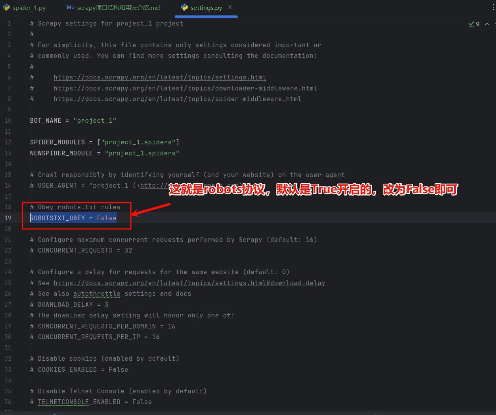
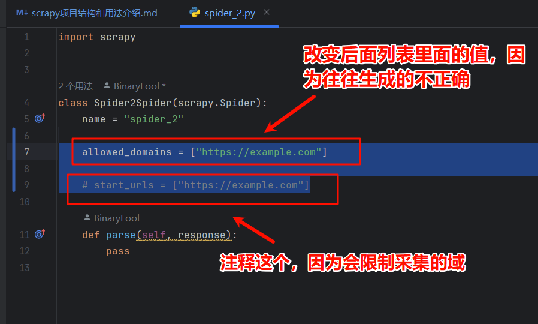
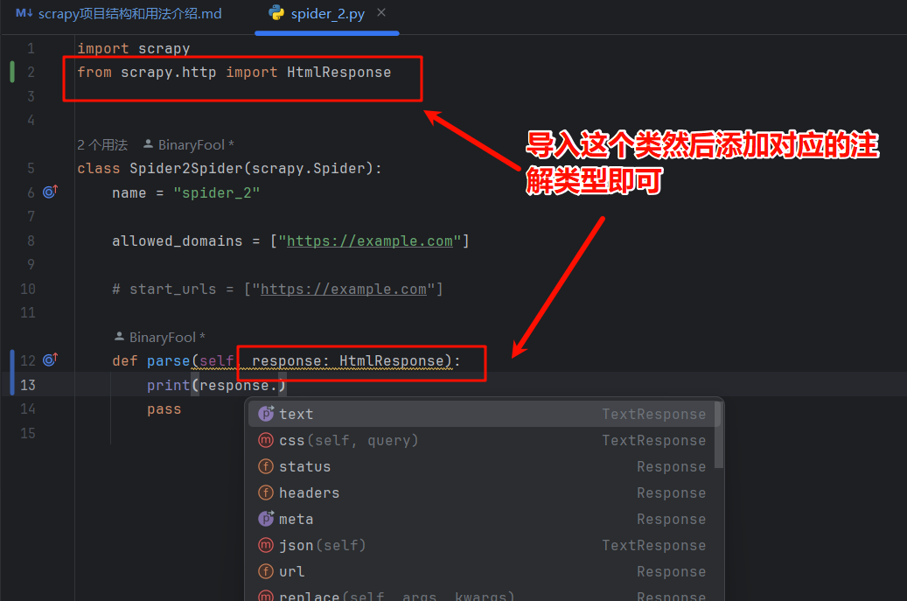
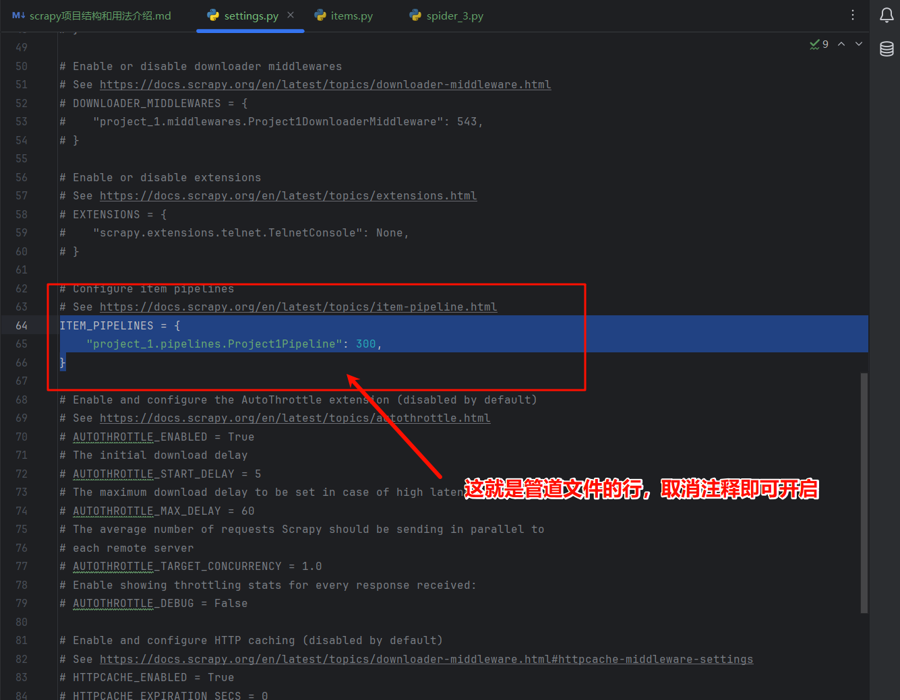
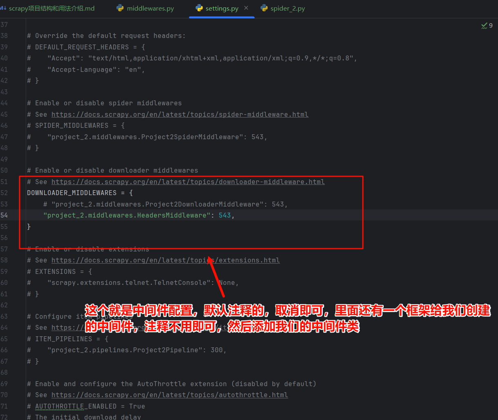
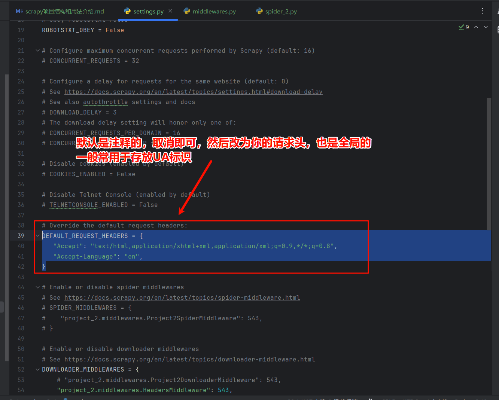
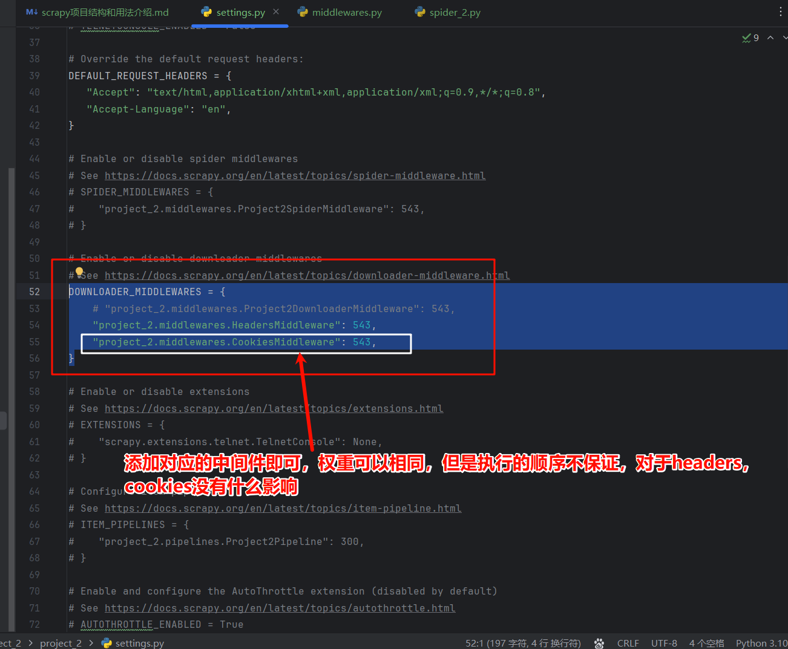
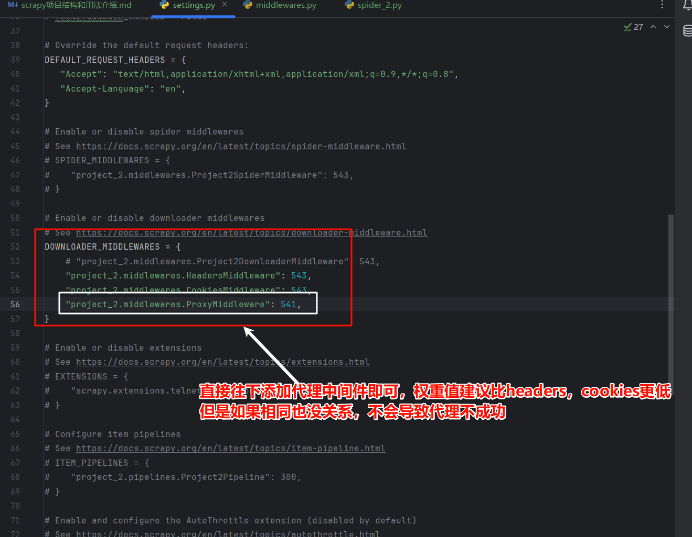

# Scrapy 项目结构说明

## 基本层级

```
myspider/
├── myspider/
│   ├── __init__.py
│   ├── items.py
│   ├── middlewares.py
│   ├── pipelines.py
│   ├── settings.py
│   └── spiders/
│       └── example.py
├── scrapy.cfg
```

## 框架文件说明

- **scrapy.cfg**：项目配置文件，告诉 Scrapy 如何找到项目。
- **myspider/**：你的项目 Python 包（名字和项目名一样）。
    - **\_\_init\_\_.py**：包初始化，通常不用动。
    - **items.py**：定义爬取的数据结构，比如要抓取哪些字段。
    - **middlewares.py**：中间件，可以拦截和处理请求、响应。
    - **pipelines.py**：处理爬取到的数据，比如保存到数据库。
    - **settings.py**：项目配置，比如并发数、User-Agent。
    - **spiders/**：放各个爬虫文件，example.py就是刚才创建的爬虫。

# Scrapy 项目爬虫文件说明

```python
import scrapy


class Spider1Spider(scrapy.Spider):
    # 爬虫的名字,通过`scrapy genspider spider_1 a.com`时创建, 后期启动爬虫项目的时候需要指定爬虫的名字
    name = "spider_1"

    # 限制只采集哪个域名下的数据，在实际使用的是后不需要限制，直接注释`allowed_domains`即可
    allowed_domains = ["baidu.com"]

    # 数据的起始网址,只要是在这个列表里面的网址会默认发送请求(如果地址是有规律的, 那么可以用列表推导是构建)
    # 默认是根据`scrapy genspider spider_1 a.com`指定域名自动生成的, 一般是错误的, 需要修改成正确的地址
    start_urls = ["https://baidu.com"]

    def parse(self, response):
        """
        运行爬虫时会使用get请求start_urls里面的网址并且返回给该函数
        response = request<请求体> + response<响应体> + parsel<css, xpath, re>
        数据处理就在该函数中
        这函数名字一定不能改
        """
        pass
```

# 项目进一步初始化

## 关闭robots协议

robots协议又称君子协议

robots协议就是网站文件写了声明不能爬取或不推荐爬取，如果不关闭scrapy程序会自动跳过不能爬取的数据，这样大大的限制了开发者的操作空间，所以关闭就不会造成数据获取不全的情况

在项目的`settings.py`文件中找到行改为`False`即可



## 注释限制域、更改请求网址

1. 在爬虫文件下修改起始网址<start_urls>
2. 注释限制允许的域 allowed_domains = \["example.com"] 这样不会限制爬取的网址



## 爬虫文件parse函数response响应体提示(可选)



# 爬虫文件函数`parse`数据处理完成返回

在爬虫文件中的`parse(self, response)`函数中处理数据完成后使用yield返回到管道文件`pipelines.py`

## 方式一，直接是用字典返回

```python
import scrapy


class Spider2Spider(scrapy.Spider):
    name = "spider_2"
    # allowed_domains = ["a.com"]
    start_urls = ["https://quotes.toscrape.com"]

    def parse(self, response):
        for item in response.css(".quote"):
            text = item.css(".text::text").get()
            author = item.css(".author::text").get()
            tags = item.css("a.tag::text").getall()

            """
            因为scrapy是异步框架，所以可以不需要等待全部数据解析完成再返回，解析了一部分就返回一部分
            使用yield返回数据是字典，scrapy会自动处理转换
            scrapy框架里面所有爬虫文件返回数据都是用yield
            返回的数据会流入到管道文件`pipelines.py`
            """
            yield {
                'text': text,
                'author': author,
                'tags': tags
            }
```

## 方式二，使用`items.py`文件里面的字段容器返回数据(推荐)

- `items.py`注册字段容器
  ```python
  # Define here the models for your scraped items
  #
  # See documentation in:
  # https://docs.scrapy.org/en/latest/topics/items.html
  
  import scrapy
  
  
  class Spider3Item(scrapy.Item):
      # define the fields for your item here like:
      # name = scrapy.Field()
      text = scrapy.Field()
      author = scrapy.Field()
      tags = scrapy.Field()
  ```

- 使用字段容器返回数据
  ```python
  import scrapy
  from ..items import Spider3Item  # 返回上级导入容器
  
  
  class Spider2Spider(scrapy.Spider):
      name = "spider_3"
      # allowed_domains = ["a.com"]
      start_urls = ["https://quotes.toscrape.com"]
  
      def parse(self, response):
          for item in response.css(".quote"):
              text = item.css(".text::text").get()
              author = item.css(".author::text").get()
              tags = item.css("a.tag::text").getall()
  
              """
              因为scrapy是异步框架，所以可以不需要等待全部数据解析完成再返回，解析了一部分就返回一部分
              可以使用scrapy给我们提供的数据容器返回，`items.py`文件中需要自己定义容器字段
              scrapy框架里面所有爬虫文件返回数据都是用yield
              返回的数据会流入到管道文件`pipelines.py`
              """
              yield Spider3Item(text=text, author=author, tags=tags)
  ```

## 方式三，使用字段容器返回多个不同数据

当遇到数据处理保存需要返回3个字段，但是已经使用yield返回了2个字段，两个都需要的时候可以考虑使用多个字段容器，然后逐一返回

1. 在`items.py`定义字段容器类

    ```python
    import scrapy
    
    
    class CustomizeItem(scrapy.Item):
        name = scrapy.Field()
        age = scrapy.Field()
    
    
    class CustomizeItem1(scrapy.Item):
        name = scrapy.Field()
        age = scrapy.Field()
        note = scrapy.Field()
    ```

2. 在爬虫文件中逐一返回给item

    ```python
    import scrapy
    
    from ..items import CustomizeItem, CustomizeItem1
    
    
    class Spider1Spider(scrapy.Spider):
        name = "spider_1"
        allowed_domains = ["a.com"]
        start_urls = ["https://a.com"]
    
        def parse(self, response):
            """
            这里编写数据提取操作,然后赋值给参数
            """
            name = "小明"
            age = 19
            note = "不吃香菜"
    
            """先返回给一个容器，因为是异步操作，同一个数据先到这里返回"""
            yield CustomizeItem(
                name=name,
                age=age
            )
    
            """返回给第二个容器, 因为是异步操作，同一个数据先到上面返回，再经过这里返回"""
            yield CustomizeItem1(
                name=name,
                age=age,
                note=note
            )
    ```
3. 在管道里面判断是哪个容器返回的数据
   写在`数据流入管道保存pipelines.py`一级标题下面的`判断是哪个items来的数据`二级标题

# 数据流入管道保存`pipelines.py`

需要开启管道才可以处理数据的保存

## 开启管道

- 在`settings.py`文件中取消注释即可开启管道，如果需要开启多条管道在`pipelines.py`文件下编写对应的类然后在注册过去即可
- 多条管道的作用：当需要保存不同数据类型的数据，比如json，excel，可以利用不同的管道处理不同的数据，还可用进行另一步骤的数据处理
- 管道字典里面的键后面跟着一个数字叫权重，值越小表示权重越高，执行的优先级就越高，如果你有多条管道则也需要一并添加进去
- 如果你在 Scrapy 中有多个数据管道，且它们的权重（数字）相同，它们都会被执行，但执行的顺序是不确定的。
    - 数据管道同权重会导致内存一时间过多，建议上下浮动3个值
    - 避免依赖执行顺序：如果一个管道的输出是另一个管道的输入，最好给它们设置不同的权重。



## 管道文件说明

- 写在`pipelines.py`文件里面，可以自定义类名称，开始构建项目会给你一个默认的，可以选择删除，自己构建自己需要的管道需求
- 可以在该文件中写多个不同需求的数据管道类，应对不同需求的数据处理，但是注意的是都需要注册管道配置中`settings.py`,不然无法生效
- init,open_spider两个初始化函数的区别
    - \_\_init__ 是类的构造函数，负责对象实例的初始化，通常只调用一次。
    - open_spider(self, spider) 是在爬虫启动时调用的，专门用于爬虫级别的初始化。
    - 在实际开发中很少使用到__init__，一般常用框架自带有的

```python
class CustomizePipeline(object):
    def __init__(self):
        """这是类的构造函数，负责对象实例的初始化，通常只调用一次。"""
        """
        该函数和open_spider效果类似，但是人家框架有就推荐使用人家框架的，一般不使用这个，注释忽略即可
        """

    def open_spider(self, spider):
        """不能更改的方法名和参数"""
        """
        是在爬虫启动时调用的，专门用于爬虫级别的初始化。
        框架项目的初始化方法，每次项目启动的时候只会执行一次，一般用于打开文件或数据库连接
        """

    def process_item(self, item, spider):
        """不能更改的方法名和参数"""
        """框架的数据流处理方法，每次数据一从item流入就会调用该方法，用于数据处理"""
        """
        流入的数据会用item接收，字典形式，需要保存数据提取就使用字典的方式提取数据
    
        return item 不能注释或者删除，因为Scrapy 的 pipeline 是一个链式处理机制，
        如果你在某个 process_item 方法里不 return item，这个 item 就不会继续传给后面的 pipeline 或内置组件了。
        如果漏了 return item，后续的 pipeline 根本拿不到数据
        """

        return item

    def close_spider(self, spider):
        """不能更改的方法名和参数"""
        """框架项目的结束调用方法，在整个项目结束前会调用该方法函数，和open_spider函数配套"""
```

## 判断是哪个items来的数据

在管道文件中的类中的`process_item`函数里面判断，如果是这个类型则使用什么代码，不是又干什么

```python
from .items import CustomizeItem, CustomizeItem1  # 需要导入类用于判断是哪个类类型


class TypeJudge(object):
    def process_item(self, item, spider):
        """
        使用isinstance()函数来判断是不是正确的类型
        -- 参数一，数据
        -- 参数二，数据类型（基本数据类型，也可以是类的类型）
        """

        print("传递过来的类型：", type(item))

        if isinstance(item, CustomizeItem):
            print("需要执行的代码")
        elif isinstance(item, CustomizeItem1):
            print("又需要执行的代码")
        else:
            print("都不是，则可以不进行或还要进行其他操作")
            # 如果都不是想要不继续处理则需要记得在这块写  return item

        return item
```

## 内置管道

提供给开发者使用的，这样更方便开发者注重逻辑问题即可

### ImagesPipeline管道，处理图片的

- 虽然父级已经写好了如何使用，但是实际开发可能需要自定义一些东西，所以这里用的是继承编写
- 在设置中指定输出的文件堆路径，保存的数据就都在这个项目父级下的指定文件名中
  ```python
  IMAGES_STORE = 'downloaded_images'  # 图片保存到这个目录
  ``` 
- 记得开启管道

```python
import scrapy
from scrapy.pipelines.images import ImagesPipeline  # 专门用于保存图片的类


class SaveImagesPipeline(ImagesPipeline):
    def get_media_requests(self, item, info):
        """
        固定的格式，不能改变
        往下编写你的请求即可，会自动处理你请求下载的图片
        """
        for url in item['urls']:  # 如果你传入的是一个列表可以这样编写，如果是一个就单独写就行
            yield scrapy.Request(  # 和在爬虫文件`start_requests`函数中请求方法一样写的，post就post，但是一般图片都是get
                # 参数如果有headers和cookies等也可以传入
                url=url,
                meta={'title': item['title']}  # 用于传入到下一个函数使用
            )

    def file_path(self, request, response=None, info=None, *, item=None):
        """
        指定文件保存的路径, 重命名，若不重写这函数，图片名为哈希
        :return: 文件路径
        """
        dir_name = request.meta.get('title')  # `get_media_requests`函数使用请求体中的meta参数传递下来的

        return dir_name + '.jpg' # return返回的结果就是 目录 + 文件名
```

### FilesPipeline管道，处理二进制文件的

- 虽然父级已经写好了如何使用，但是实际开发可能需要自定义一些东西，所以这里用的是继承编写，它和ImagesPipeline管道很像
- 在设置中指定输出的文件堆路径，保存的数据就都在这个项目父级下的指定文件名中
  ```python
  FILES_STORE = 'downloaded_files'  # 保存二进制文件的目录
  ``` 
- 记得开启管道

```python
import scrapy
from scrapy.pipelines.files import FilesPipeline  # 专门用于保存二进制文件的类


class SaveFilesPipeline(FilesPipeline):
    def get_media_requests(self, item, info):
        """
        固定的格式，不能改变
        往下编写你的请求即可，会自动处理你请求下载的图片
        """
        for url in item["urls"]:  # 如果你传入的是一个列表可以这样编写，如果是一个就单独写就行
            yield scrapy.Request(  # 和在爬虫文件`start_requests`函数中请求方法一样写的
                # 参数如果有headers和cookies等也可以传入
                url=url,
                meta={'title': item['title']}  # 用于传入到下一个函数使用
            )

    def file_path(self, request, response=None, info=None, *, item=None):
        """
        指定文件保存的路径, 重命名，若不重写这函数，图片名为哈希
        :return: 文件路径
        """
        dir_name = request.meta.get('title')

        return dir_name + '.mp3'  # 返回完整保存路径
```

# 自定义请求

## GET请求

scrapy.Request() == scrapy.http.Request()   
Scrapy 官方只给常用的几个请求类做了简写导入，所以这两个没区别

```python
import scrapy


class Spider6Spider(scrapy.Spider):
    name = "spider_6"

    def start_requests(self):
        """
        scrapy.Request() == scrapy.http.Request()
        Scrapy 官方只给常用的几个请求类做了简写导入，所以这两个没区别

        scrapy.Request() 可以发送get请求
        使用yield来返回数据是scrapy的遵循规则（固定的）
        如果你是有规律的或有需求的可以使用for来进行循环请求，使用yield返回scrapy请求对象即可
        """
        # 查询的参数scrapy不支持分开构建，只能写在url里面
        yield scrapy.Request(
            url='https://example.com?&name=小明',

            # 回调函数，本次请求你需要使用哪个函数来处理数据
            callback=self.parse
        )

    def parse(self, response):
        print("拿到了数据：", response.text)

```

## POST请求

默认发送的是GET请求，如果需要发送POST请求就需要在爬虫文件中重写`start_requests`函数的方法

### Form Data数据请求

scrapy.FormRequest() == scrapy.http.FormRequest()   
Scrapy 官方只给常用的几个请求类做了简写导入，所以这两个没区别

```python
import scrapy


class Spider4Spider(scrapy.Spider):
    name = "spider_4"

    def start_requests(self):
        """
        scrapy.FormRequest() == scrapy.http.FormRequest()
        Scrapy 官方只给常用的几个请求类做了简写导入，所以这两个没区别

        scrapy.FormRequest() 可以发送post请求，需要注意的是此对象需要对应 Form Data 提交的请求参数才可以使用
        使用yield来返回数据是scrapy的遵循规则（固定的）
        如果你是有规律的或有需求的可以使用for来进行循环请求，使用yield返回scrapy请求对象即可
        """
        yield scrapy.FormRequest(
            url='https://example.com',

            # 请求的form data 数据
            formdata={
                'name': '小明',
                'age': 19
            },

            # 回调函数，本次请求你需要使用哪个函数来处理数据
            callback=self.parse
        )

    def parse(self, response):
        print("拿到了数据：", response.text)
```

### Json数据请求

使用`scrapy.http.JsonRequest()`方法

```python
import scrapy


class Spider5Spider(scrapy.Spider):
    name = "spider_5"

    def start_requests(self):
        """
        scrapy.http.JsonRequest 可以发送post请求，需要注意的是此对象需要对应 json 提交的请求参数才可以使用
        使用yield来返回数据是scrapy的遵循规则（固定的）
        如果你是有规律的或有需求的可以使用for来进行循环请求，使用yield返回scrapy请求对象即可
        """
        yield scrapy.http.JsonRequest(
            url='https://example.com',

            # 请求的json数据
            data={
                'name': '小明',
                'age': 19
            },

            # 回调函数，本次请求你需要使用哪个函数来处理数据
            callback=self.parse
        )

    def parse(self, response):
        print("拿到了数据：", response.text)
```

## meta数据传递

- meta 是用来在请求之间传递数据的, 或者两函数之间数据传递
- 简单说就是：你可以通过 meta 把一些临时信息，从一个请求传给下一个请求。每一次创建请求对象的时候都会重新构建
- meta是一个字典
- 主要用途示例
    - 传递登录状态、cookie
    - 在翻页时传递页码
    - 在回调函数里拿到之前保存的数据
    - 控制请求优先级、深度等
- Scrapy自己也会往meta里塞一些系统数据，比如：
    - download_timeout：下载超时时间
    - depth：当前请求的深度（用于深度优先、广度优先）
    - redirect_urls：如果有跳转，记录跳转过来的 URL
    - handle_httpstatus_list：处理哪些 HTTP 状态码
    - proxy：当前请求使用的代理
    - dont_redirect：是否禁止重定向
    - 等等。

> 这里使用get自定义请求来演示

```python
import scrapy


class Spider6Spider(scrapy.Spider):
    name = "spider_7"

    def start_requests(self):
        """
        meta 是用来在请求之间传递数据的。
        简单说就是：
            你可以通过 meta 把一些临时信息，从一个请求传给下一个请求。
        """
        yield scrapy.Request(
            # 只能拼接查询参数，不能像requests模块一样构建
            url='https://example.com?name=小明',
            callback=self.parse,

            # 传递给下一个请求，使用meta来传递
            meta={'name': '小明', 'age': 19}
        )

    def parse(self, response):
        print("meta传递的数据：", response.meta['name'], response.meta['age'])
        print("拿到了数据：", response.text)
``` 

# headers、cookies、proxy

## 请求头的添加

**scrapy框架默认会自带一些请求头的常用字段**

### 方式一，直接在请求体中添加

直接在请求体中添加是一次性的，下一次请求还需要重新添加，这很麻烦，不推荐

```python
import scrapy


class Spider1Spider(scrapy.Spider):
    name = "spider_1"

    def start_requests(self):
        """
        这是一次性请求头的添加
        """
        yield scrapy.http.Request(
            url='https://www.baidu.com',
            headers={
                'user-agent': 'Mozilla/5.0 (Windows NT 10.0; Win64; x64) AppleWebKit/537.36 (KHTML, like Gecko) Chrome/135.0.0.0 Safari/537.36'
            },
            callback=self.parse
        )

    def parse(self, response):
        print("状态码：", response.status)
        pass
```

### 方式二，使用中间件

如果需要开启管道来应用到scrapy项目上

#### 编写中间件

在`middlewares.py`文件中编写你的请求头中间件即可，其余的不要管

```python
# 名称自定义，没有唯一的
class HeadersMiddleware:
    """请求头中间件，每个请求都会经过这个中间键，全局配置"""

    def process_request(self, request, spider):
        """
        request 指代的就是请求体对象
        框架默认会自带一些请求头的常用字段 字典类型
        使用update 进行字典数据的跟新 这样就会替换框架原本自带的请求头
        中间件也需要进行管道开启
        """
        request.headers.update({
            'user-agent': 'Mozilla/5.0 (Windows NT 10.0; Win64; x64) AppleWebKit/537.36 (KHTML, like Gecko) Chrome/135.0.0.0 Safari/537.36'
        })

        return None  # 注意要返回 None，不然 Scrapy不会继续处理请求
```

#### 开启注册中间件



### 方式三，在`settings.py`文件中设置

**该方法也是全局配置的**



### 请求头设置方法优先级和更新关系

他们并不是项目排斥的，是互存的

- 优先级：
    - 第一优先级:在爬虫文件中, 构建请求体对象的时候,使用headers关键字添加请求头<局部>
    - 第二优先级:在中间件中间添加请求头字段 <全局>
    - 第三优先级:在设置文件中 DEFAULT_REQUEST_HEADERS 可以配置请求头<全局>
- 请求头更新关系：
    - 先从 settings 的 DEFAULT_REQUEST_HEADERS 里复制一份初始 headers。
    - 中间件里如果修改了（或者重新赋值了 request.headers），会覆盖原来的。
    - 请求体（Request里的headers参数）如果单独传了，会覆盖对应的字段，不是合并所有来源。
- 请求头更新关系举例：
    - settings.py 里：
      ```python
    
      DEFAULT_REQUEST_HEADERS = {
        'User-Agent': 'Settings-UA',
        'Accept': 'Settings-Accept',
        'origin': '127.0.0.1'
      }
      ``` 
    - 中间件修改：
      ```python
      request.headers['User-Agent'] = 'Middleware-UA'
      ```
    - 请求体指定：
      ```python
      scrapy.Request(
        url="http://example.com",
        headers={'Accept': 'Request-Accept'}
      )
      ```

    - 最终请求头是：
      > 没有的字段才会保留 settings 里的，比如上面 User-Agent 是中间件改的，Accept 是请求体改的。
      ```python
      {
        'User-Agent': 'Middleware-UA', # 中间件覆盖
        'Accept': 'Request-Accept', # 请求体覆盖
        'origin': '127.0.0.1' # 没有被覆盖
      }
      ```

## cookies添加

settings.py （通常默认没有 cookies 设置）

### 方式一，使用中间件

#### 编写中间件

在`middlewares.py`文件中编写你的cookie中间件即可，其余的不要管

```python
class CookiesMiddleware:
    def process_request(self, request, spider):
        """
        request 指代的就是请求体对象
        中间件也需要进行管道开启
        """

        # 为什么不使用update,因为要要确保cookie的干净，也可以使用update，只不过这样写更严谨
        request.cookies = {
            'sessionid': 'abc1234567890',
            'userid': 'user_test'
        }

        return None  # 注意要返回 None，不然 Scrapy不会继续处理请求
```

#### 开启注册中间件



### 方式二，在请求体中

```python
import scrapy


class Spider3Spider(scrapy.Spider):
    name = "spider_3"

    def start_requests(self):
        yield scrapy.http.Request(
            url='https://example.com',

            # 不会导致中间件的cookies失效，只是添加或更新了
            cookies={'new_value': '111'},

            callback=self.parse
        )

    def parse(self, response):
        pass
```

### cookies设置方法优先级和更新关系

上面的两种cookie设置方法都是共存的

和headers请求头的更新方法和优先级一样的，只不过`settings.py`没有默认的cookies

## 代理添加

除了下面写到的中间件代理，也可以在请求体中更改当次请求的代理，但是是一次性的    
只对当前这个请求生效，下一个请求不自动继承！    
更改参数里面的`meta\['proxy']`即可

### 编写中间件

```python
class ProxyMiddleware:
    def process_request(self, request, spider):
        """
        request 指代的就是请求体对象
        中间件也需要进行管道开启
        """

        # 直接设置代理
        request.meta['proxy'] = 'http://127.0.0.1:7890'
        return None  # 注意要返回 None，不然 Scrapy不会继续处理请求
```

### 开启注册代理

**权重可以和headers，cookies一样，但是因为是代理，建议设置权重值更低一点**



# `settings.py`高级自定义参数

## 设置超时时间

和requests的timeout效果一样的,超时就会报错

```python
DOWNLOAD_TIMEOUT = 7  # 设置超时的时间
```

## 设置重试请求

当请求出现错误的时候可以进行重试请求

```python
RETRY_ENABLED = True  # 是否开启超时重试
RETRY_TIMES = 2  # 重试次数
RETRY_HTTP_CODES = [500, 502, 503, 504, 522, 524, 408, 429]  # 重试的状态码
```

## 设置请求速率

因为scrapy是异步框架，请求可能导致过快导致对方网站响应不过来或导致我们ip被封禁   
所以我们可以限制请求的速率，每次请求间隔多久才进行下一次请求

```python
# 单位：秒
DOWNLOAD_DELAY = 2
```
