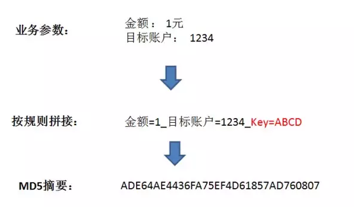
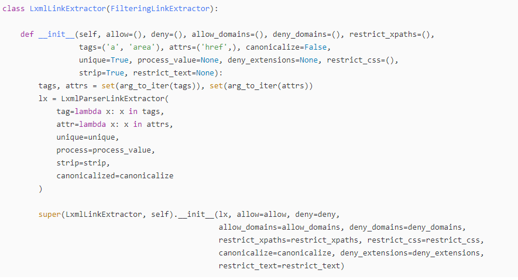

## 1、过滤器

当我们使用scrapy框架采集数据的时候，有可能采集的数据会有重复数据的情况。其实这种重复数据在我们在抓取的时候就可以通过代码逻辑进行过滤。主要思路有两种过滤方式：

* 一种是对请求的数据结果进行过滤
* 一种是对请求体对象进行过滤

### 1、1 对结果去重

有时候采集的数据需要进行去重。

```python
import csv

filter_item = []


class Qd04EnglishPipeline:
    def __init__(self):
        self.f = open('eng.csv', mode='w', encoding='utf-8', newline="")
        self.csv_write = csv.writer(self.f)

    def process_item(self, item, spider):
        if item not in filter_item:
            filter_item.append(item)
            d = dict(item)
            self.csv_write.writerow(d.values())
        return item

    def close_spider(self, spider):
        self.f.close()

```

#### 摘要算法

​		Message-Digest Algorithm 5，消息摘要算法版本5。由Ron Rivest（RSA公司）在1992年提出，目前被广泛应用于数据完整性校验、数据（消息）摘要、数据加密等。MD2、MD4、MD5 都产生16字节（128位）的校验值，一般用32位十六进制数表示。

**摘要哈希生成的正确姿势是什么样呢？分三步：**

​		1、收集相关业务参数，在这里是金额和目标账户。当然，实际应用中的参数肯定比这多得多，这里只是做了简化。

​		2、按照规则，把参数名和参数值拼接成一个字符串，同时把给定的**密钥**也拼接起来。之所以需要密钥，是因为攻击者也可能获知拼接规则。

​		3、利用MD5算法，从原文生成哈希值。MD5生成的哈希值是128位的二进制数，也就是32位的十六进制数。



考虑把多种摘要算法结合使用比如

~~~
明文：abcd

MD5摘要：e2fc714c4727ee9395f324cd2e7f331f
~~~

Python 的 hashlib 提供了常见的摘要算法，如MD5，SHA1等等。

摘要算法又称哈希算法、散列算法。它通过一个函数，把任意长度的数据转换为一个长度固定的数据串（通常用16进制的字符串表示）。

假设我们有多个字典 

```python
d1 = {"name": "张三", "age": 18, "hobby": "吃"}
d2 = {"name": "李四", "age": 18, "hobby": "喝"}
d3 = {"name": "王五", "age": 18, "hobby": "玩"}
items = [d1, d2, d3]
print(items)
```

突然后多出一条数据

```
d4 = {"name":"赵六","age":18,"hobby":"乐"}
```

需要判断第四条数据是否在这之前已经出现过了

用之前学习过的方式就是用一下方法判断

```python
d4 = {"name": "赵六", "age": 18, "hobby": "乐"}
if d4 not in items:
    print('d4不存在于items')
```

当数据内容非常多的时候，判断就会占用很多的内存空间。

这时候就可以记录他们的hash值，这样就可以让内存的负担减少很多

```python
h1 = hashlib.md5(json.dumps(d1).encode()).hexdigest()
h2 = hashlib.md5(json.dumps(d2).encode()).hexdigest()
h3 = hashlib.md5(json.dumps(d3).encode()).hexdigest()
items2 = [h1, h2, h3]
print(items2)
h4 = hashlib.md5(json.dumps(d4).encode()).hexdigest()
if h4 not in items2:
    print('d4不存在与items2')
```

摘要算法就是通过摘要函数对任意长度的数据 `data` 计算出固定长度的摘要，目的是为了发现原始数据是否被人篡改过。

摘要算法之所以能指出数据是否被篡改过，就是因为摘要函数是一个单向函数，计算哈希很容易，但通过`digest`反推`data`却非常困难。而且，对原始数据做一个bit的修改，都会导致计算出的摘要完全不同。

```python
import hashlib
import json

md5 = hashlib.md5()
d = {'name':'asd'}
d_str = json.dumps(d)
md5.update(d_str.encode())

h = md5.hexdigest()
```

一种更简单的实现方式

```python
import hashlib
import json

h = hashlib.md5(request.url).hexdigest()
```

### 9、3 指纹过滤器

​		去重处理可以避免将重复性的数据保存到数据库中以造成大量的冗余性数据。不要在获得爬虫的结果后进行内容过滤,这样做只不过是避免后端数据库出现重复数据。

​		去重处理对于一次性爬取是有效的,但对于增量式爬网则恰恰相反。对于持续性长的增量式爬网,应该进行"前置过滤",这样可以有效地减少爬虫出动的次数。在发出请求之前检查询爬虫是否曾爬取过该URL,如果已爬取过,则让爬虫直接跳过该请求以避免重复出动爬虫。

​		Scrapy 提供了一个很好的请求指纹过滤器(Request Fingerprint duplicates filter)

​		`scrapy.dupefilters.ReppupeFilter`,当它被启用后,会自动记录所有成功返回响应的请求的URL，并将其以文件(requests.seen)方式保存在项目目录中。请求指纹过滤器的原理是为每个URL生成一个指纹并记录下来,一旦当前请求的URL在指纹库中有记录,就自动跳过该请求。

默认情况下这个过滤器是被自动启用的。当然也可以根据自身的需求编写自定义的过滤器。

```python
class RFPDupeFilter(BaseDupeFilter):
    """Request Fingerprint duplicates filter"""
    # 默认是一个指纹过滤器,会对整个 request = url/method/params/...
    def __init__(self, path=None, debug=False):
        self.file = None
        # 集合 存在于内存型的
        self.fingerprints = set()

    @classmethod
    def from_settings(cls, settings):
        debug = settings.getbool('DUPEFILTER_DEBUG')
        return cls(job_dir(settings), debug)

    def request_seen(self, request):
        # 拿到 request 摘要出来的指纹
        fp = self.request_fingerprint(request)
        if fp in self.fingerprints:
            # 如果返回 True 已经存在数据了
            return True
        # 如果不存在,就记录到指纹里面
        self.fingerprints.add(fp)
        if self.file:
            self.file.write(fp + os.linesep)

    def request_fingerprint(self, request):
        return request_fingerprint(request)
```

当数据量不大时(大约在200MB内),可以直接在内存中进行去重处理(例如,可以使用 `set()` 进行去重),而更省事又能对去重状态进行持久化的办法就是采用 `scrapy.dupefilters.RFPDupeFilter`  。

当数据量在5GB以内时,建议采用上文中的 `RedisDupeFilter` 进行去重,当然这要求服务器的内存必须大于5GB,否则Redis可能会将机器的内存耗光。

当数据量达到10~100GB级别时,由于内存有限,就必须用"位"来去重,才能够满足需求。而**布隆过滤器**就是将去重对象映射到几个内存"位",通过几个位的0/1值来判断一个对象是否已经存在,以应对海量级的请求数据的重复性校验。

思考：过滤url，过滤hash url， 过滤请求url


## 2、CrawlSpider

​		在之前 Scrapy 的基本使用当中，spider 如果要重新发送请求的话，就需要自己解析页面，然后发送请求。而 CrawlSpider 则可以通过设置 url 条件自动发送请求。

​		CrawlSpider 是 Spider 的一个派生类，相对于 Spider 来说，功能进行了更新，使用也更加方便。

### 2、1 创建 CrawlSpider

和之前创建 spider 一样，虽然可以在创建 Scrapy 项目之后手动构造 spider，但是 Scrapy 也给出了在终端下创建 CrawlSpider 的指令：

```undefined
scrapy genspider 爬虫名字 域名限制 -t crawl
```

在终端中使用上边的指令就能够使用 Scrapy 中的模板创建 CrawlSpider。

### 2、2 LinkExtractors

CrawlSpider 与 spider 不同的是就在于下一次请求的 url 不需要自己手动解析，而这一点则是通过 LinkExtractors 实现的。LinkExtractors 原型为：



其中的参数为：

- allow：允许的 url。所有满足这个正则表达式的 url 都会被提取
- deny：禁止的 url。所有满足这个正则表达式的 url 都不会被提取
- allow_domains：允许的域名。只有在这个里面指定的域名的 url 才会被提取
- deny_domains：禁止的域名。所有在这个里面指定的域名的 url 都不会被提取
- restrict_xpaths：严格的 xpath 过滤规则。和 allow 共同过滤链接，优先级高
- restrict_css：严格的 css过滤规则。和 allow 共同过滤链接，优先级高

### 2、3 Rule

LinkExtractors 需要传递到 Rule 类对象中才能发挥作用。Rule 类为：

```python
class Rule:
 
    def __init__(self, link_extractor=None, callback=None, cb_kwargs=None, follow=None, process_links=None, process_request=None, errback=None):
        self.link_extractor = link_extractor or _default_link_extractor
        self.callback = callback
        self.errback = errback
        self.cb_kwargs = cb_kwargs or {}
        self.process_links = process_links or _identity
        self.process_request = process_request or _identity_process_request
        self.process_request_argcount = None
        self.follow = follow if follow is not None else not callback
```

常见的参数为：

- link_extractor：LinkExtractor 对象，用于定义爬取规则
- callback：对于满足该规则的 url 所要执行的回掉函数，类似于之前提到的 scrapy.Request() 中的callback。而 CrawlSpider 使用了 parse 作为回调函数，因此不要覆盖 parse 作为回调函数自己的回调函数
- follow：从 response 中提取的链接是否需要跟进
- process_links：从 link_extractor 中获取到链接后会传递给这个函数，用来过滤不需要爬取的链接

除了上述的这些差别，Crawlspider 和 spider 基本没有什么差别了。

### 2、4 settings.py

仍旧需要设置：

- ROBOTSTXT_OBEY：设置为 False，否则为 True。True 表示遵守机器协议，此时爬虫会首先找 robots.txt 文件，如果找不到则会停止
- DEFAULT_REQUEST_HEADERS：默认请求头，可以在其中添加 User-Agent，表示该请求是从浏览器发出的，而不是爬虫
- DOWNLOAD_DELAY：表示下载的延迟，防止过快
- ITEM_PIPELINES：启用 pipelines.py

### 2、5 items.py

```python
class Qd12ZzzjItem(scrapy.Item):
    # define the fields for your item here like:
    # name = scrapy.Field()
    title = scrapy.Field()
    url = scrapy.Field()
    info = scrapy.Field()
    img_url = scrapy.Field()
```

### 2、6 spider

```python
class ZzzjSpider(CrawlSpider):
    name = "zzzj"
    allowed_domains = ["chinaz.com"]
    start_urls = ['https://top.chinaz.com/hangyemap.html']

    rules = (
        Rule(LinkExtractor(allow=r'/hangye/index_.*?.html',
                           restrict_css=('.Taleft', '.Taright')
                           ),
             callback='parse_item',  # callback回调, 传递回调函数名字的字符串形式
             follow=True  # 是否继续从响应内容里提取url链接, 是否需要跟进, 默认是跟进的
             )
    )

    def parse_item(self, response):
        print('response.url::', response.url)

        # print(response.text)
        lis = response.css('.listCentent li')

        for li in lis:
            title = li.css('.rightTxtHead a::text').get()  # 网站名
            url = li.css('.col-gray::text').get()  # 网站url
            info = li.css('.RtCInfo::text').get().strip()  # 网站简介
            img_url = li.css('.leftImg a img::attr(src)').get()  # 网站图片地址

            item = Qd12ZzzjItem(title=title, url=url, info=info, img_url=img_url)
            yield item

        # 提取下一页部分连接
        next_page = response.css('.ListPageWrap a:last-of-type::attr(href)').get()
        print('next_page:::', next_page)

        if next_page:
            # 注意拼接规则, 这里有狗
            all_url = 'https://top.chinaz.com' + next_page
            print('all_url: ', all_url)
            yield scrapy.Request(all_url, callback=self.parse_item)
```

### 2、7 pipelines.py

```python
class Qd12ZzzjPipeline:
    def open_spider(self, spider):
        self.f = open('站长之家.csv', mode='a', encoding='utf-8', newline='')
        self.csv_write = csv.DictWriter(self.f, fieldnames=['title', 'url', 'info', 'img_url'])
        self.csv_write.writeheader()

    def process_item(self, item, spider):
        d = dict(item)
        self.csv_write.writerow(d)
        return item

    def close_spider(self, spider):
        self.f.close()
```

在 CrawlSpider 中需要注意的就是 spider 的写法，别的和之前差不多。