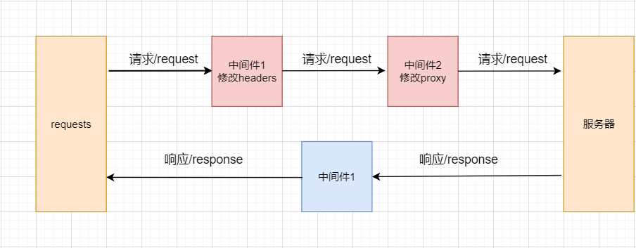

##  1、构建请求

### 1、1  scrapy.Request

> Request 和 Response 对象，用于爬网网站。 

Request对象用来描述一个HTTP请求，下面是其构造器方法的参数列表：

```python
Request(url, callback=None, method='GET', headers=None, body=None,
        cookies=None, meta=None, encoding='utf-8', priority=0,
        dont_filter=False, errback=None, flags=None, cb_kwargs=None)
```

- **url**（*字符串*）–此请求的URL
- **callback**（*callable*）–将以请求的响应（一旦下载）作为第一个参数调用的函数。有关更多信息，请参见下面的将其他数据传递给回调函数。如果“请求”未指定回调，parse() 则将使用“Spider” 方法。请注意，如果在处理过程中引发异常，则会调用errback。
- **method**（*字符串*）–此请求的HTTP方法。默认为`'GET'`。
- **meta**（dict）– Request.meta属性的初始值。如果给出，则在此参数中传递的字典将被浅表复制。
- **headers**（dict）–请求头。dict值可以是字符串（对于单值标头）或列表（对于多值标头）。如果 `None`作为值传递，则将根本不发送HTTP标头。

```python
class QuotesSpider(scrapy.Spider):
    name = 'quotes_3'

    allowed_domains = ['toscrape.com']

    start_urls = ['http://quotes.toscrape.com/']


    def parse(self, response):
        quotes = response.css('.quote')

        for quote in quotes:
            text = quote.css('.text::text').get()
            author = quote.css('.author::text').get()
            tags = quote.css('.tag::text').getall()
            yield Qd01QuotesItem(text=text, author=author, tags=tags)

        next_page = response.css('.next a::attr(href)').get()
        if next_page:                                                       
            next_url = 'http://quotes.toscrape.com' + next_page
            yield scrapy.Request(next_url, callback=self.parse)
```

### 1、2 scrapy.FormRequest

FormRequest类扩展了请求基类 **Request** 具有处理HTML表单的功能。

* scrapy 框架中封装的 FormRequest 方法可以帮助我们发送post请求

  - 参数

    **formdata**：是包含HTML表单数据的字典（或可为（键、值）元组），实际上指的就是请求参数，这些数据将被URL编码并分配给请求主体。

    **callback**：回调函数指定，此次请求交给哪个函数做处理。

    ~~~python
    from scrapy.http import FormRequest
    ...
    def start_requests(self):
            yield scrapy.FormRequest(url='http://www.kfc.com.cn/kfccda/ashx/GetStoreList.ashx?op=keyword',
                                     formdata={
                                        'cname': '',
                                        'pid': '',
                                        'keyword': '北京',
                                        'pageIndex': '1',
                                        'pageSize': '10',
                                     },
                                     callback=self.parse,
                                    )  
    ~~~

### 1、3 scrapy.JsonRequest

使用JSON负载发送JSON POST请求：

~~~python
    def start_requests(self):
        yield scrapy.http.JsonRequest(
            url='http://www.zfcg.sh.gov.cn/portal/category',
            data={"pageNo": 1, 
                  "pageSize": 15, 
                  "categoryCode": 
                  "ZcyAnnouncement1", 
                  "_t": 1687780627000},
            callback=self.parse

        )
~~~

### 1、4 meta的使用

meta 参数主要用于在两个函数之间传递参数

meta 一次性的，每次创建 request 对象，都会重新创建

meta是一个字典，它的主要作用是用来传递数据的，meta = {‘key1’:value1}，如果想在下一个函数中取出 value1, 只需得到上一个函数的 meta[‘key1’] 即可， 因为meta是随着Request产生时传递的，下一个函数得到的Response对象中就会有meta，即 response.meta。请瞧下面的简单例子更好的帮助理解：

```python
class Win4000Spider(scrapy.Spider):
    name = 'win4000'
    allowed_domains = ['win4000.com']  # 大规模采集
    start_urls = ['http://www.win4000.com/mobile_detail_169064.html']

    def parse(self, response):
        item = Win4000Item()
        item['title'] = response.css('h1::text').get()
        item['img_urls'] = response.css('.pic-large::attr(src)').getall()
        print('item', item)
        # 这个 item 先不返回 只有一个下载地址
        # yield item

        next_page = response.css('.pic-next-img a::attr(href)').get()
        if next_page:
            yield scrapy.Request(next_page, callback=self.parse1, meta={'item': item})

    def parse1(self, response):
        # 第二页的数据
        item = response.meta.get('item')
```


## 2、 Middlewares

### 2、1 Downloader Middlewares

Downloader Middlewares(下载器中间件)，位于 scrapy 引擎和下载器之间的一层组件。作用：

- 引擎将 **请求** 传递给下载器之前， **下载中间件** 可以对 **请求** 进行一系列处理。比如设置请求的User-Agent，设置代理等
- 在下载器完成将Response传递给引擎之前，下载中间件可以对响应进行一系列处理。

我们主要使用下载中间件处理请求，一般会对请求设置随机的User-Agent，设置随机的代理。目的在于防止爬取网站的反爬虫策略。

 **如果完全没有中间件，爬虫的流程如下图所示。** 

   

**使用了中间件以后，爬虫的流程如下图所示。** 



Scrapy 自动生成的这个文件名称为 middlewares.py，名字后面的 s 表示复数，说明这个文件里面可以放很多个中间件。可以看到有一个 **SpiderMiddleware** （爬虫中间件）中间件 和 **DownloaderMiddleware** （下载中间件）中间件 

在 middlewares.py 中添加下面一段代码（可以在 **下载中间件这个类** 里面写，也可以把 **爬虫中间件** 和 **下载中间件** 这两个类删了，自己写个 下载中间件的类。推荐自己单写一个类作为下载中间件）： 

默认下载器中间件代码如下：

```python
class TutorialDownloaderMiddleware(object):
    # Not all methods need to be defined. If a method is not defined,
    # scrapy acts as if the downloader middleware does not modify the
    # passed objects.

    @classmethod
    def from_crawler(cls, crawler):
        # This method is used by Scrapy to create your spiders.
        s = cls()
        crawler.signals.connect(s.spider_opened, signal=signals.spider_opened)
        return s

    def process_request(self, request, spider):
        # Called for each request that goes through the downloader middleware.
        # 调用通过下载器中间件的每个请求。

        # Must either:
        # - return None: continue processing this request
        # - or return a Response object
        # - or return a Request object
        # - or raise IgnoreRequest: process_exception() methods of
        #   installed downloader middleware will be called

        # 必须：
        # - return None：继续处理这个请求
        # - 或者返回一个 Response 对象
        # - 或者返回一个 Request 对象
        # - 或者抛出 IgnoreRequest ：下载中间件的 process_exception() 将被激活
        return None

    def process_response(self, request, response, spider):
        # Called with the response returned from the downloader.
        # 调用 downloader 返回的 response

        # Must either;
        # - return a Response object
        # - return a Request object
        # - or raise IgnoreRequest

        # 必须：
        # - 返回一个 Response 对象
        # - 返回一个 Request 对象
        # - 或者抛出一个 IgnoreRequest
        return response

    def process_exception(self, request, exception, spider):
        # Called when a download handler or a process_request()
        # (from other downloader middleware) raises an exception.

        # 激发一个下载处理器或者一个 process_request() (来自其他下载器中间件) 抛出一个异常
        
        # Must either:
        # - return None: continue processing this exception
        # - return a Response object: stops process_exception() chain
        # - return a Request object: stops process_exception() chain
        
        # 必须：
        # - return None：继续处理这个请求
        # - 或者返回一个 Response 对象: 停止 process_exception() 调用链
        # - 或者返回一个 Requests 对象: 停止 process_exception() 调用链
        pass

    def spider_opened(self, spider):
        spider.logger.info('Spider opened: %s' % spider.name)

```

#### process_request

> process_request(self, request, spider)

该方法是下载器中间件类中的一个方法，该方法是每个请求从引擎发送给下载器下载之前都会经过该方法。所以该方法经常用来处理请求头的替换，IP的更改，Cookie等的替换。

**参数:** 

- request (Request 对象) – 处理的request

- spider (Spider 对象) – 该request对应的spider

#### process_response

> process_response(self, request, response, spider)

该方法是下载器中间件类中的一个方法，该方法是每个响应从下载器发送给spider之前都会经过该方法。

**参数**：

* request (Request 对象) – response所对应的request 

* response (Response 对象) – 被处理的response 

* spider (Spider 对象) – response所对应的spider 

### 2、2 随机替换请求头

有些网站需要用户在访问的时候确认用户采用的是用浏览器来进行访问的，也就是常见的User-Agent信息。在Scrapy中也可以设置相应的请求头信息。

```python
class UserAgentDownloaderMiddleware(object):
    def __init__(self):
        self.fake = Faker('en_US')

    def process_request(self, request, spider):
        useragent = self.fake.user_agent()
        request.headers.update({"User-Agent": useragent})
        return None

```

**注意：**

除了编写下载器中间件，还需要激活配置好的中间件才能生效。


**重点：**

`DOWNLOADER_MIDDLEWARES` 设置会与 Scrapy 默认定义的 `DOWNLOADER_MIDDLEWARES_BASE`设置合并(但不是覆盖)， 而后根据顺序(order)进行排序，最后得到启用中间件的有序列表: 第一个中间件是最靠近引擎的，最后一个中间件是最靠近下载器的。

关于如何分配中间件的顺序请查看 `DOWNLOADER_MIDDLEWARES_BASE` 设置，而后根据想要放置中间件的位置选择一个值。 **由于每个中间件执行不同的动作，中间件可能会依赖于之前(或者之后)执行的中间件，因此顺序是很重要的。**

faker 是一个虚假数据生成库,可以随机生成各种虚假数据用于测试

```
import faker
fake = faker.Faker()
fake.name()
Out[4]: 'John Richardson'
fake.name_male()
Out[5]: 'Anthony Jackson'
fake.user_agent()
Out[6]: 'Mozilla/5.0 (compatible; MSIE 8.0; Windows NT 5.2; Trident/3.1)'
```

### 2、3 随机替换IP

​		当使用Scrapy爬虫大规模请求某个网站时，经常会遇到封禁IP的情况。在这种情况下，设置IP代理就非常重要了。在Scrapy中设置代理IP也很简单，其原理就是在发送请求之前，指定一个可用的IP代理服务器即可。同样，IP的设置也是在下载器中间件里面设置，自定义自己的IP代理中间件。

```python
class HttpProxyDownloaderMiddleware(object):
    def __init__(self):
        self.fake = Faker()

    def process_request(self, request, spider):
        proxy = "117.57.90.19:31840"
        request.meta['proxy'] = 'http://' + proxy
        return None
```

**注意：**  需要激活代理中间件。

### 2、4 设置 Cookie 值

有时候我们想要爬取的数据可以需要登录才能看到，这时候我们就需要登录网页。登陆后的网页一般都会在本地保存该网页的登录信息Cookies在本地。只要获取该Cookie，那么在以后跳转到其他网页的时候，只需要携带该Cookie即可。

```python
class CookieDownloaderMiddleware(object):
    def process_request(self, request, spider):
        cookie = "cookie"
        request.headers.update({'Cookie': cookie})
        return None
```

**注意：** 需要激活Cookie中间件。

### 2、5 超时重试

可以直接查看scrapy的源码，在setting文件夹下的 default_settings.py 文件里面可以找到超时重试的配置选项。

 ```
RETRY_ENABLED = True	# 是否开启超时重试
RETRY_TIMES = 2  # initial response + 2 retries = 3 requests 重试次数
RETRY_HTTP_CODES = [500, 502, 503, 504, 522, 524, 408, 429]  # 重试的状态码

DOWNLOAD_TIMEOUT = 1  # 设置超时的时间
 ```
