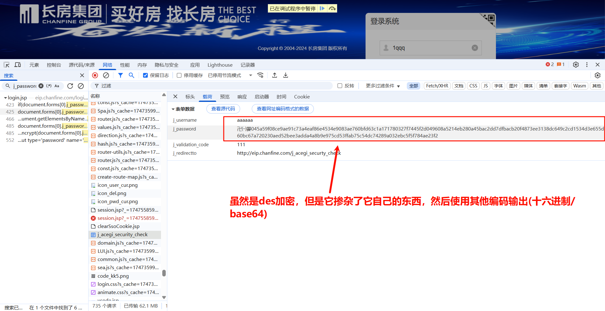

# 介绍

处理网络请求参数或响应参数反爬需要可以看懂基本的js代码，js的基本知识和js解密文档放在当前目录的`../../JavaScript基本知识`文件夹下

请求参数/响应参数反爬都是类似的操作，只需要找到执行对应的js代码即可模拟，扣取js代码如果有多个分支时尽量看它走了哪个分支再进行扣取，不然代码量很大

很明显下面的请求参数是用了不的同数据参数请求的，这就是反爬的基本手段，但是爬虫开发者可以通过很多手段进行模拟它的参数加密操作


# 加密方式判断

当遇到人家明显标注的是标准加解密方法或有检验判断出是标准的加解密 就需要先自己使用标准的方案模拟一下是否没有加盐，如果是则可以使用python的库进行模拟，否则如果扣取js代码会有上万行

- 基本的加密操作(直接扣取即可)
  

- 标准库的加密操作(可以选择python的库模拟)
  

# 寻找加密位置

如果遇到标准的加密可以选择使用python模拟

## key关键字搜索

通过复制加密数据的key搜索，在你认为可疑的地方打上断点然后再次触发请求即可断住，如果是正确的加密位置，鼠标选中放入 函数/代码 上进入然后一步一步扣取它的js代码即可


## 表单id搜索

通过表单的id搜索可以找到获取到值后需要执行的操作，也就可能是加密位置


## js关键字搜索

虽然可以搜索关键字，但不是每个网站都会这样写出标准的关键字

### encrypt/decrypt关键字

encrypt/decrypt关键字是用于数据加解密的操作


### JSON.parse关键字

JSON.parse()是js用于JSON 格式的字符串 转换为对应的 JavaScript 对象或值


### 堆栈查找

堆栈查找就需要一步一步跟栈了，无法很快的寻找到加解密的位置，需要有耐心的观察堆栈的代码执行，可以结合关键字来进行查询

# 常规的标准加解密

常规的标准加解密可以选择使用python模拟，也可以选择下载js对应的包导入到你的js文件中，否则需要扣取它的js代码然后一步一步调试会很长

## MD5

很明显没有混淆，展示的就是md5加密操作，md5加密是不可逆的，单向加密，无法解密


```python
"""python模拟加密，结果是一样的"""
import hashlib  # 内置模块

encrypt_text = '111111'

md5_obj = hashlib.md5(encrypt_text.encode('utf-8')).hexdigest()

print(md5_obj)
```

## DES

### 使用python认识des加密过程

加密的结果是二进制，如果需要可用使用进制转换为16进制等其他方式

```shell
pip install pycryptodomex
```

```python
from Cryptodome.Cipher import DES


# 用于填充指定长度的数据
def padding(data):
    while len(data) % 8 != 0:
        data += ' '
    return data


# 加密的数据必须是8的整数倍，如果不是使用空格补齐
encrypt_text = 'hello word'  # 很明显不是8的整数倍
encrypt_text = padding(encrypt_text)  # 使用函数重新成为8的整数倍

# 定义des对象
key = b'zzzddsef'  # 密钥的长度必须是8位
des = DES.new(key=key, mode=DES.MODE_ECB)  # 加密密钥，加密模式

# 加密操作
result = des.encrypt(encrypt_text.encode('utf-8'))  # encode是用于编码为二进制，传入的内容需要是二进制的
print(result)

# 解密操作,加密使用什么模式和密钥解密一样使用
result = des.decrypt(result).decode()  # 因为加密使用了encode编码为二进制，所以如果需要看到可读数据就需要decode解码
print(result)
```

### 加密场景

如果想要扣取des加密会有很多代码，他是在`CryptoJS`的js模块库里面的，只需要下载对应的js库然后导入然后修改必要的代码即可，也可以使用python模拟加密

下面场景需要先进入代码里面然后扣取它自己掺杂的内容js代码，再加入`CryptoJS`库来协助操作




## AES

### 使用python认识AES加密过程

加密的结果是二进制，如果需要可用使用进制转换为16进制等其他方式

```shell
pip install pycryptodomex
```

```python
from Cryptodome.Cipher import AES
from Cryptodome import Random  # 随机数据

# 密钥的长度可以使用 <16> 128位、192位或256位。密钥的长度不同，推荐加密轮数也不同
key = b'this is a 16 key'

# 随机生成一个iv --> 盐: 在加密解密的过程中加料
# AES.block_size --> 生成长度等于AES块大小的不可重复的密钥向量, 随机的
iv = Random.new().read(AES.block_size)

data = '待加密数据'

# AES加密对象，加密模式可用自由选择，用什么加密就用什么解密
aes = AES.new(key, AES.MODE_CFB, iv)

# 进行加密，接收的需要是二进制数据，所以使用encode()转码
encrypt_data = aes.encrypt(data.encode())
print(encrypt_data)

# 解密,加密使用什么模式和密钥解密一样使用
aes = AES.new(key, AES.MODE_CFB, iv)
decrypt_data = aes.decrypt(encrypt_data)
print(decrypt_data)
print(decrypt_data.decode())  # 因为加密进行了转码，所以这里进行解码才能看到真实数据
```

### 加密场景

如果想要扣取AES加密会有很多代码，他是在`CryptoJS`的js模块库里面的，只需要下载对应的js库然后导入然后修改必要的代码即可，也可以使用python模拟加密


### 遇到问题

当你扣完js代码后不是你的js代码语法错误出现`Error: Malformed UTF-8 data`报错信息就需要考虑到数据是否正确了

虽然抓包工具里面传入的是你请求得到的数据，但是就是解码失败，就需要使用python删减一些请求头模拟一下请求看结果是否相同或者如果是get请求直接复制url重新在新的标签页请求一下看数据是否相同

1. 抓包工具显示抓取到的数据
   
2. 抓包工具显示传入的数据(相同数据传入)
   
3. 你扣取完成js代码后传入相同的数据报错(相同数据传入)
   
4. 使用python删减部分请求头返回的另一个类型数据(数据不同了)
   这两个数据实际是相同的，只是展示的数据格式不一样
   

## RSA

### 使用python认识RSA加密过程

加密的结果是二进制，如果需要可用使用进制转换为16进制等其他方式

```shell
pip install rsa
```

```python
import rsa

# 生成公钥和私钥
public_key, private_key = rsa.newkeys(2048)  # 参数值为2的倍数即可
print('公钥对象:', public_key)
print('私钥对象:', private_key)  # 私钥包含公钥私钥

# 将生成的公钥和私钥进行转换，以便存储
pub = public_key.save_pkcs1()  # bytes类型
pri = private_key.save_pkcs1()

# 保存公钥，私钥，二进制写入，pem后缀
with open('public.pem', mode='wb') as f:
    f.write(pub)
with open('private.pem', mode='wb') as f:
    f.write(pri)

""""--------------上面的代码是用于生成和保存的，生产环境中不会频繁替换，都是保存下来的，但是这也是根据需求不同再决定----------------------------------"""

"""加密"""
with open('public.pem', mode='rb') as f:
    pub = f.read()
    # 重新加载公钥对象
    public_key = rsa.PublicKey.load_pkcs1(pub)

# 利用公钥进行数据的加密
info = "待加密数据"
info_res = rsa.encrypt(info.encode(), public_key)  # 传入二进制数据和公钥对象
print("加密结果：", info_res)

"""解密"""
with open('private.pem', 'rb') as f:
    pri = f.read()
    # 重新加载私钥对象
    private_key = rsa.PrivateKey.load_pkcs1(pri)

# 利用私钥进行还原
msg = rsa.decrypt(info_res, private_key)  # 传入二进制加密结果和私钥对象，解密后任然是二进制, 需要解码
print("解密结果：", msg.decode())
```

### 加密场景

根据实际情况决定是否标准的rsa加密算法


# eval混淆

## 原理

原理：eval("字符串")  可以将字符串转化成语言可执行的对象

```javascript
// 常规代码
(
    function () {
        console.log(100);
        return 200
    }
)()


// eval混淆代码
eval("(\n" +
    "    function (){\n" +
    "        console.log(100);\n" +
    "        return 200\n" +
    "    }\n" +
    ")()")
```

## eval混淆的代码


## 转换混淆解析网站

该网站可以把js的eval混淆的代码抓换为可读的js代码，也可以转换为eval混淆的代码

https://wangye.org/tools/scripts/eval/

# 变量名混淆

变量名混淆是指将变量名替换为无意义的字符串，增加代码的难度和防止代码的逆向分析。

**字符串字面量混淆：** 首先提取全部的字符串，在全局作用域创建一个字符串数组，同时转义字符增大 阅读难度，然后将字符串出现的地方替换成为数组元素的引用

```javascript
var _0x3012 = ['substring', 'atob', 'charCodeAt', 'push', 'test'];
// 打乱数组的内容
(function (_0x3ed35c, _0x48b8fe) {
    var _0x1ad9d9 = function (_0x8eeda7) {
        while (--_0x8eeda7) {
            _0x3ed35c['push'](_0x3ed35c['shift']());
        }
    };
    _0x1ad9d9(++_0x48b8fe);
}(_0x3012, 0x153));
// 用函数实现字符串的调用
var _0x3a8e = function (_0xc40c11, _0x32bbb2) {
    _0xc40c11 = _0xc40c11 - 0x0;
    var _0x4e269a = _0x3012[_0xc40c11];
    return _0x4e269a;
};

console.log(_0x3a8e('0x4'));
```

# 使用特定符号编写 js 脚本

原理：
jsfuck 源于一门编程语言 brainfuck ，其主要的思想就是只使用8种特定的符号来编写代码。而 jsfuck
也是沿用了这个思想，它仅仅使用6种符号来编写代码。它们分别是(、)、+、\[、]、!。

破解方法：打完断点后在**Console** 控制台查看

抓换为jsfuck代码网站：https://jsfuck.com/

**特殊符号**

```javascript
[][(![] + [])[+!+[]] + (!![] + [])[+[]]][([][(![] + [])[+!+[]] + (!![] + [])[+[]]] + [])[!+[] + !+[] + !+[]] + (!![] + [][(![] + [])[+!+[]] + (!![] + [])[+[]]])[+!+[] + [+[]]] + ([][[]] + [])[+!+[]] + (![] + [])[!+[] + !+[] + !+[]] + (!![] + [])[+[]] + (!![] + [])[+!+[]] + ([][[]] + [])[+[]] + ([][(![] + [])[+!+[]] + (!![] + [])[+[]]] + [])[!+[] + !+[] + !+[]] + (!![] + [])[+[]] + (!![] + [][(![] + [])[+!+[]] + (!![] + [])[+[]]])[+!+[] + [+[]]] + (!![] + [])[+!+[]]]((!![] + [])[+!+[]] + (!![] + [])[!+[] + !+[] + !+[]] + (!![] + [])[+[]] + ([][[]] + [])[+[]] + (!![] + [])[+!+[]] + ([][[]] + [])[+!+[]] + (+[![]] + [][(![] + [])[+!+[]] + (!![] + [])[+[]]])[+!+[] + [+!+[]]] + (!![] + [])[!+[] + !+[] + !+[]] + (+(!+[] + !+[] + !+[] + [+!+[]]))[(!![] + [])[+[]] + (!![] + [][(![] + [])[+!+[]] + (!![] + [])[+[]]])[+!+[] + [+[]]] + ([] + [])[([][(![] + [])[+!+[]] + (!![] + [])[+[]]] + [])[!+[] + !+[] + !+[]] + (!![] + [][(![] + [])[+!+[]] + (!![] + [])[+[]]])[+!+[] + [+[]]] + ([][[]] + [])[+!+[]] + (![] + [])[!+[] + !+[] + !+[]] + (!![] + [])[+[]] + (!![] + [])[+!+[]] + ([][[]] + [])[+[]] + ([][(![] + [])[+!+[]] + (!![] + [])[+[]]] + [])[!+[] + !+[] + !+[]] + (!![] + [])[+[]] + (!![] + [][(![] + [])[+!+[]] + (!![] + [])[+[]]])[+!+[] + [+[]]] + (!![] + [])[+!+[]]][([][[]] + [])[+!+[]] + (![] + [])[+!+[]] + ((+[])[([][(![] + [])[+!+[]] + (!![] + [])[+[]]] + [])[!+[] + !+[] + !+[]] + (!![] + [][(![] + [])[+!+[]] + (!![] + [])[+[]]])[+!+[] + [+[]]] + ([][[]] + [])[+!+[]] + (![] + [])[!+[] + !+[] + !+[]] + (!![] + [])[+[]] + (!![] + [])[+!+[]] + ([][[]] + [])[+[]] + ([][(![] + [])[+!+[]] + (!![] + [])[+[]]] + [])[!+[] + !+[] + !+[]] + (!![] + [])[+[]] + (!![] + [][(![] + [])[+!+[]] + (!![] + [])[+[]]])[+!+[] + [+[]]] + (!![] + [])[+!+[]]] + [])[+!+[] + [+!+[]]] + (!![] + [])[!+[] + !+[] + !+[]]]](!+[] + !+[] + !+[] + [!+[] + !+[]]) + (![] + [])[+!+[]] + (![] + [])[!+[] + !+[]])()(([][(![] + [])[+!+[]] + (!![] + [])[+[]]] + [])[!+[] + !+[] + !+[]] + (!![] + [][(![] + [])[+!+[]] + (!![] + [])[+[]]])[+!+[] + [+[]]] + ([][[]] + [])[+!+[]] + (![] + [])[!+[] + !+[] + !+[]] + (!![] + [][(![] + [])[+!+[]] + (!![] + [])[+[]]])[+!+[] + [+[]]] + (![] + [])[!+[] + !+[]] + (!![] + [])[!+[] + !+[] + !+[]] + (+(+!+[] + [+!+[]] + (!![] + [])[!+[] + !+[] + !+[]] + [!+[] + !+[]] + [+[]]) + [])[+!+[]] + (![] + [])[!+[] + !+[]] + (!![] + [][(![] + [])[+!+[]] + (!![] + [])[+[]]])[+!+[] + [+[]]] + (![] + [+[]] + ([] + [])[([][(![] + [])[+!+[]] + (!![] + [])[+[]]] + [])[!+[] + !+[] + !+[]] + (!![] + [][(![] + [])[+!+[]] + (!![] + [])[+[]]])[+!+[] + [+[]]] + ([][[]] + [])[+!+[]] + (![] + [])[!+[] + !+[] + !+[]] + (!![] + [])[+[]] + (!![] + [])[+!+[]] + ([][[]] + [])[+[]] + ([][(![] + [])[+!+[]] + (!![] + [])[+[]]] + [])[!+[] + !+[] + !+[]] + (!![] + [])[+[]] + (!![] + [][(![] + [])[+!+[]] + (!![] + [])[+[]]])[+!+[] + [+[]]] + (!![] + [])[+!+[]]])[!+[] + !+[] + [+[]]] + ([][(![] + [])[+!+[]] + (!![] + [])[+[]]] + [])[+!+[] + [+!+[]]] + [+!+[]] + [+!+[]] + [+!+[]] + ([] + [] + [][(![] + [])[+!+[]] + (!![] + [])[+[]]])[+!+[] + [!+[] + !+[]]])
```

**正常源码**

```javascript
console.log(111)
```

# AAEncode混淆（表情包加密）

js支持Unicode，因此支持Unicode里收录的所有国家语言，如果我们有的语言和我们定义的变量长得很相似（例如0和o）,那么因此有了这种混淆。

表情包加密网址：https://www.sojson.com/aaencode.html

**表情包加密**

```javascript
ﾟωﾟﾉ = /｀ｍ´）ﾉ ~┻━┻   //*´∇｀sojson.com*/ ['_'];
o = (ﾟｰﾟ) = _ = 3;
c = (ﾟΘﾟ) = (ﾟｰﾟ) - (ﾟｰﾟ);
(ﾟДﾟ) = (ﾟΘﾟ) = (o ^ _ ^ o) / (o ^ _ ^ o);
(ﾟДﾟ) = {ﾟΘﾟ: '_', ﾟωﾟﾉ: ((ﾟωﾟﾉ == 3) + '_') [ﾟΘﾟ], ﾟｰﾟﾉ: (ﾟωﾟﾉ + '_')[o ^ _ ^ o - (ﾟΘﾟ)], ﾟДﾟﾉ: ((ﾟｰﾟ == 3) + '_')[ﾟｰﾟ]};
(ﾟДﾟ) [ﾟΘﾟ] = ((ﾟωﾟﾉ == 3) + '_') [c ^ _ ^ o];
(ﾟДﾟ) ['c'] = ((ﾟДﾟ) + '_') [(ﾟｰﾟ) + (ﾟｰﾟ) - (ﾟΘﾟ)];
(ﾟДﾟ) ['o'] = ((ﾟДﾟ) + '_') [ﾟΘﾟ];
(ﾟoﾟ) = (ﾟДﾟ) ['c'] + (ﾟДﾟ) ['o'] + (ﾟωﾟﾉ + '_')[ﾟΘﾟ] + ((ﾟωﾟﾉ == 3) + '_') [ﾟｰﾟ] + ((ﾟДﾟ) + '_') [(ﾟｰﾟ) + (ﾟｰﾟ)] + ((ﾟｰﾟ == 3) + '_') [ﾟΘﾟ] + ((ﾟｰﾟ == 3) + '_') [(ﾟｰﾟ) - (ﾟΘﾟ)] + (ﾟДﾟ) ['c'] + ((ﾟДﾟ) + '_') [(ﾟｰﾟ) + (ﾟｰﾟ)] + (ﾟДﾟ) ['o'] + ((ﾟｰﾟ == 3) + '_') [ﾟΘﾟ];
(ﾟДﾟ) ['_'] = (o ^ _ ^ o) [ﾟoﾟ] [ﾟoﾟ];
(ﾟεﾟ) = ((ﾟｰﾟ == 3) + '_') [ﾟΘﾟ] + (ﾟДﾟ).ﾟДﾟﾉ + ((ﾟДﾟ) + '_') [(ﾟｰﾟ) + (ﾟｰﾟ)] + ((ﾟｰﾟ == 3) + '_') [o ^ _ ^ o - ﾟΘﾟ] + ((ﾟｰﾟ == 3) + '_') [ﾟΘﾟ] + (ﾟωﾟﾉ + '_') [ﾟΘﾟ];
(ﾟｰﾟ) += (ﾟΘﾟ);
(ﾟДﾟ)[ﾟεﾟ] = '\\';
(ﾟДﾟ).ﾟΘﾟﾉ = (ﾟДﾟ + ﾟｰﾟ)[o ^ _ ^ o - (ﾟΘﾟ)];
(oﾟｰﾟo) = (ﾟωﾟﾉ + '_')[c ^ _ ^ o];
(ﾟДﾟ) [ﾟoﾟ] = '\"';
(ﾟДﾟ) ['_']((ﾟДﾟ) ['_'](ﾟεﾟ + (ﾟДﾟ)[ﾟoﾟ] + (ﾟДﾟ)[ﾟεﾟ] + (ﾟΘﾟ) + (ﾟｰﾟ) + (o ^ _ ^ o) + (ﾟДﾟ)[ﾟεﾟ] + (ﾟΘﾟ) + ((ﾟｰﾟ) + (ﾟΘﾟ)) + ((ﾟｰﾟ) + (o ^ _ ^ o)) + (ﾟДﾟ)[ﾟεﾟ] + (ﾟΘﾟ) + ((ﾟｰﾟ) + (ﾟΘﾟ)) + ((o ^ _ ^ o) + (o ^ _ ^ o)) + (ﾟДﾟ)[ﾟεﾟ] + (ﾟΘﾟ) + ((o ^ _ ^ o) + (o ^ _ ^ o)) + (o ^ _ ^ o) + (ﾟДﾟ)[ﾟεﾟ] + (ﾟΘﾟ) + ((ﾟｰﾟ) + (ﾟΘﾟ)) + ((ﾟｰﾟ) + (o ^ _ ^ o)) + (ﾟДﾟ)[ﾟεﾟ] + (ﾟΘﾟ) + ((ﾟｰﾟ) + (ﾟΘﾟ)) + (ﾟｰﾟ) + (ﾟДﾟ)[ﾟεﾟ] + (ﾟΘﾟ) + (ﾟｰﾟ) + ((ﾟｰﾟ) + (ﾟΘﾟ)) + (ﾟДﾟ)[ﾟεﾟ] + ((ﾟｰﾟ) + (ﾟΘﾟ)) + ((o ^ _ ^ o) + (o ^ _ ^ o)) + (ﾟДﾟ)[ﾟεﾟ] + (ﾟΘﾟ) + ((ﾟｰﾟ) + (ﾟΘﾟ)) + (ﾟｰﾟ) + (ﾟДﾟ)[ﾟεﾟ] + (ﾟΘﾟ) + ((ﾟｰﾟ) + (ﾟΘﾟ)) + ((ﾟｰﾟ) + (o ^ _ ^ o)) + (ﾟДﾟ)[ﾟεﾟ] + (ﾟΘﾟ) + (ﾟｰﾟ) + ((ﾟｰﾟ) + (o ^ _ ^ o)) + (ﾟДﾟ)[ﾟεﾟ] + ((ﾟｰﾟ) + (ﾟΘﾟ)) + (c ^ _ ^ o) + (ﾟДﾟ)[ﾟεﾟ] + ((o ^ _ ^ o) + (o ^ _ ^ o)) + (ﾟΘﾟ) + (ﾟДﾟ)[ﾟεﾟ] + ((o ^ _ ^ o) + (o ^ _ ^ o)) + (ﾟΘﾟ) + (ﾟДﾟ)[ﾟεﾟ] + ((o ^ _ ^ o) + (o ^ _ ^ o)) + (ﾟΘﾟ) + (ﾟДﾟ)[ﾟεﾟ] + ((ﾟｰﾟ) + (ﾟΘﾟ)) + (ﾟΘﾟ) + (ﾟДﾟ)[ﾟoﾟ])(ﾟΘﾟ))((ﾟΘﾟ) + (ﾟДﾟ)[ﾟεﾟ] + ((ﾟｰﾟ) + (ﾟΘﾟ)) + (ﾟΘﾟ) + (ﾟДﾟ)[ﾟoﾟ]);
```

**源码**

```javascript
console.log(111)
```

# 注

还有很多方式拦截爬虫开发者得到想要的数据，不断学习才能变得更强大，反爬虫工程师也会随着数据的重要新而变得厉害，那么爬虫工程师也需要不断的学习变得更厉害

