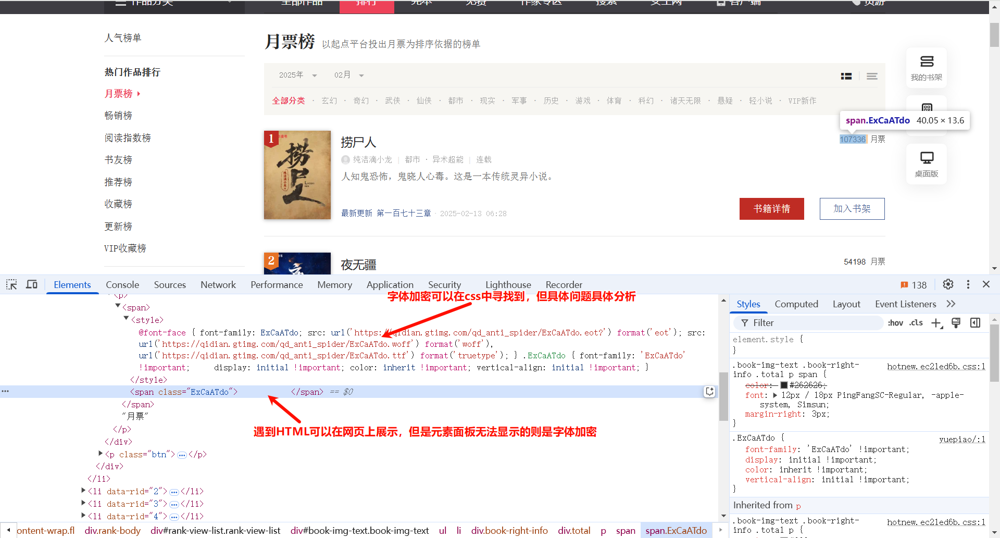
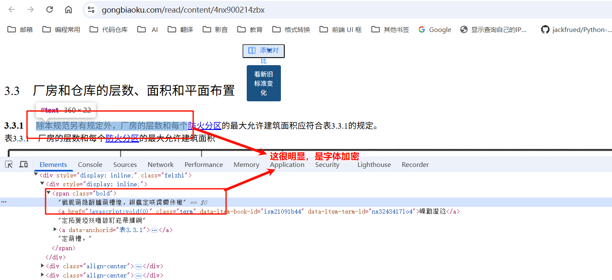
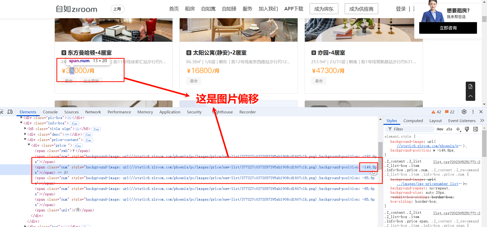

# 什么是字体加密

字体加密是一种用于保护网页内容的技术，通过自定义字体文件对网页上的文字进行加密，使得直接复制或查看源代码时无法获取原始文字内容。
这种技术常用于防止内容被轻易抓取或复制，尤其在需要保护版权或敏感信息的场景中。

# 字体加密是什么样子

> 还有其他的字体加密，具体问题具体分析

## 方式一，

## 方式二，字体乱码

## 方式三，图片偏移

# 解决方案

**寻找规律，具体问题具体分析，几乎都是字体映射关系**

- 展示的是可读的字体，而 HTML 文件不是（上述方式二）：
    - 1.把加密的内容下载下来，然后再下载字体文件
    - 2.通过字体映射取到正确的编码（ASCII值做映射）
- 展示的是可读字体，而 HTML 显示为空（上述方式一）：
    - 1.把加密的内容下载下来（下载到本地就不会显示为空了），然后再下载字体文件
    - 2.通过里面的值取到映射的正确的编码（ASCII值做映射）
- 展示为可读字体，而 HTML 显示的是标签等有背景极其样式的（上述方式三）：
    - 1.下载好里面的标签，然后下载好偏移的背景图片
    - 2.寻找规律，偏移量多少是什么字体

