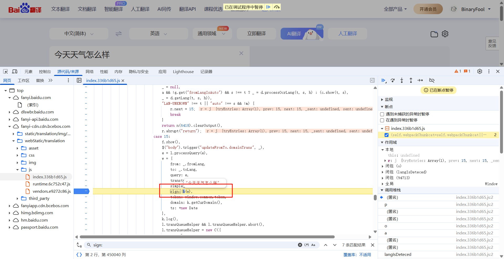

# 介绍

处理网络请求参数或响应参数反爬需要可以看懂基本的js代码，js的基本知识和js解密文档放在当前目录的`../../JavaScript基本知识`文件夹下

请求参数/响应参数反爬都是类似的操作，只需要找到执行对应的js代码即可模拟，扣取js代码如果有多个分支时尽量看它走了哪个分支再进行扣取，不然代码量很大

很明显下面的请求参数是用了不的同数据参数请求的，这就是反爬的基本手段，但是爬虫开发者可以通过很多手段进行模拟它的参数加密操作


# 加密方式判断

当遇到人家明显标注的是标准加解密方法或有检验判断出是标准的加解密 就需要先自己使用标准的方案模拟一下是否没有加盐，如果是则可以使用python的库进行模拟，否则如果扣取js代码会有上万行

- 基本的加密操作(直接扣取即可)
  

- 标准库的加密操作(可以选择python的库模拟)
  

# 寻找加密位置

如果遇到标准的加密可以选择使用python模拟

## 关键字搜索

通过复制加密数据的key搜索，在你认为可疑的地方打上断点然后再次触发请求即可断住，如果是正确的加密位置，鼠标选中放入 函数/代码 上进入然后一步一步扣取它的js代码即可


# 常规的标准加解密

常规的标准加解密可以选择使用python模拟，也可以选择下载js对应的包导入到你的js文件中，否则需要扣取它的js代码然后一步一步调试会很长

## MD5

很明显没有混淆，展示的就是md5加密操作，md5加密是不可逆的，单向加密，无法解密


```python
"""python模拟加密，结果是一样的"""
import hashlib  # 内置模块

encrypt_text = '111111'

md5_obj = hashlib.md5(encrypt_text.encode('utf-8')).hexdigest()

print(md5_obj)
```

## DES

### 使用python认识des加密过程

```shell
pip install pycryptodomex
```

```python
from Cryptodome.Cipher import DES


# 用于填充指定长度的数据
def padding(data):
    while len(data) % 8 != 0:
        data += ' '
    return data


# 加密的数据必须是8的整数倍，如果不是使用空格补齐
encrypt_text = 'hello word'  # 很明显不是8的整数倍
encrypt_text = padding(encrypt_text)  # 使用函数重新成为8的整数倍

# 定义des对象
key = b'zzzddsef'  # 密钥的长度必须是8位
des = DES.new(key=key, mode=DES.MODE_ECB)  # 加密密钥，加密模式

# 加密操作
result = des.encrypt(encrypt_text.encode('utf-8'))
print(result)

# 解密操作,加密使用什么模式和密钥解密一样使用
result = des.decrypt(result).decode()
print(result)
```

### 加密场景

如果想要扣取des加密会有很多代码，他是在`CryptoJS`的js模块库里面的，只需要下载对应的js库然后导入然后修改必要的代码即可，也可以使用python模拟加密

下面场景需要先进入代码里面然后扣取它自己掺杂的内容js代码，再加入`CryptoJS`库来协助操作


