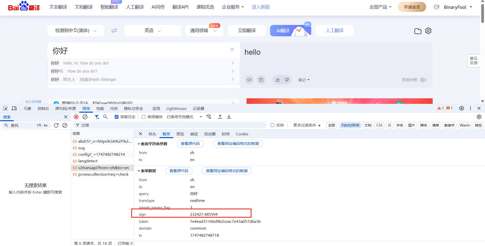
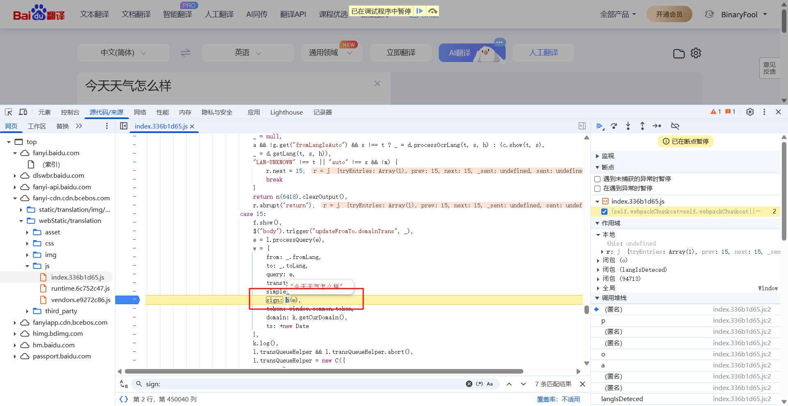

# 认识网络请求反爬

请求/响应数据反爬都是类似的操作，只需要找到执行对应的js代码即可模拟

很明显下面的请求是了不同数据就不同的参数，这就是反爬的基本手段，但是爬虫开发者可以通过很多手段进行模拟它的参数加密操作

# 网络请求参数反爬模拟方法

爬虫开发者可以通过很多方式来模拟网络请求的参数，只需要模拟成正确的参数即可完成网络请求

## 关键字搜索

通过复制加密数据的key搜索，在你认为可疑的地方打上断点然后再次触发请求即可断住，如果是正确的加密位置，鼠标选中放入函数上进入函数然后一步一步扣取它的js代码即可

